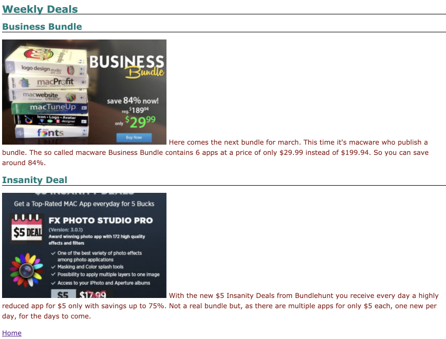

# Relative Paths II

This is the deals page now:

```html
<!DOCTYPE html>
<html>
  <head>
    <title>App Bundle Deals</title>
    <link rel="stylesheet" href="../style.css" />
  </head>
  <body>
    <h1>Weekly Deals</h1>
    <h2>Business Bundle</h2>
    <p>
       Here comes the next bundle for march. This time it's
      macware who publish a bundle. The so called macware Business Bundle contains 6 apps at a price of only $29.99
      instead of $199.94. So you can save around 84%.
    </p>
    <h2>Insanity Deal</h2>
    <p>
       With the new $5 Insanity Deals from Bundlehunt you receive
      every day a highly reduced app for $5 only with savings up to 75%. Not a real bundle but, as there are multiple
      apps for only $5 each, one new per day, for the days to come.
    </p>
    <a href="index.html">Home</a>
  </body>
</html>
```

Open the page in a browser, and try the "Home" link:


This is a broken link, easily fixed in this instance:

```html
<a href="../index.html">Home</a>
```

## Image Links

This images needed for this page:


Download and save them into the images folder in the project. See the `Downloading Images` step from Lab-01 for a refresher on how to do this.

This will not be sufficient to get the images linked however. The image tags still do not have the correct path:

```html
...

...

...
```

Try correcting the link as shown:

```html
...

...

...
```

The page should render correctly now:


