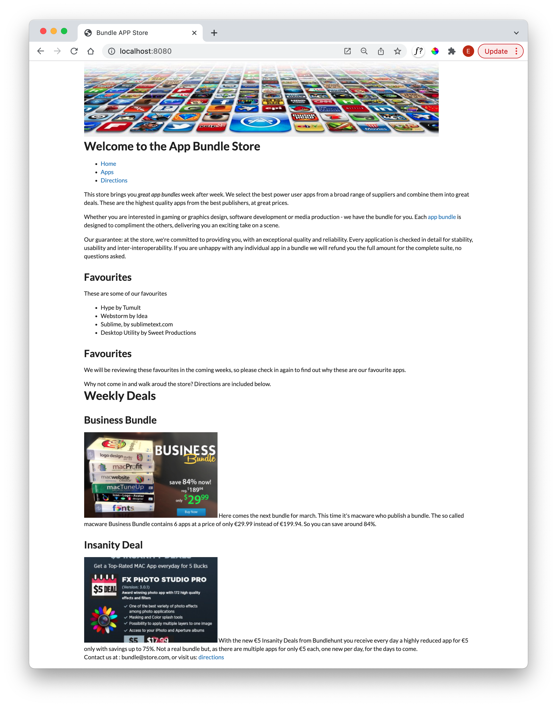

# Container

The CSS framework we are using is documented here:

- <https://fomantic-ui.com/>

Select 'Menu' to reveal the element list:

We will be using perhaps 6 or 7 of these components.

The first one we will implement is `container`:

- <https://fomantic-ui.com/elements/container.html>

This is introduced in the layout.njk:

### layout.njk

~~~html
  ...
    <body class="ui container">
  ...
~~~

All we have done is revise the element to have a class "ui container". This "ui ..." prefix is the Semantic-ui pattern for selecting a class from its framework.

Make sure the change now, and make sure it adjust the margins like this:

Review the documentation again to get a general understanding of the Container style:

- <https://fomantic-ui.com/elements/container.html>