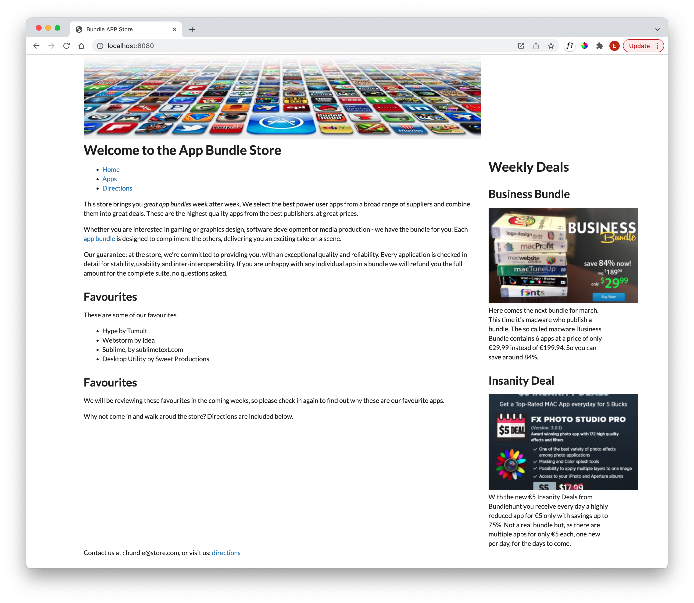

# Grid

We have carefully used the new grid CSS standard in our project, but have now removed it to use Semantic UI. This framework has its own grid system:

- <https://fomantic-ui.com/collections/grid.html>

This is somewhat simpler to master, and has a number of features our implementation did not address.

Here is how we might revise `index.html` (not showing the contents of the article and the aside):

### layout.njk

~~~html
  ...
      <section class="ui grid">
        <section class="ui twelve wide column">
                
          {{ content | safe }}
        </section>
        <aside class="ui four wide column">
          
        </aside>
      </section>
  ...
~~~

We are using the 16 column grid system defined by Semantic-UI - and defining a 12 - 4 ratio between our main article and the included aside.

The page should look like this now:

This is the complete layout file:

### layout.njk

~~~html
<!DOCTYPE html>
<html>
  <head>
    <meta charset="utf-8">
    <title>Bundle APP Store</title>
    
    <link rel="stylesheet" type="text/css" href="https://cdn.jsdelivr.net/npm/fomantic-ui@2.8.8/dist/semantic.min.css">
    
  </head>
  <body class="ui container">
    
    <main>
      
      <section class="ui grid">
        <section class="ui twelve wide column">
                
          {{ content | safe }}
        </section>
        <aside class="ui four wide column">
          
        </aside>
      </section>
      
    </main>
  </body>
</html>
~~~

