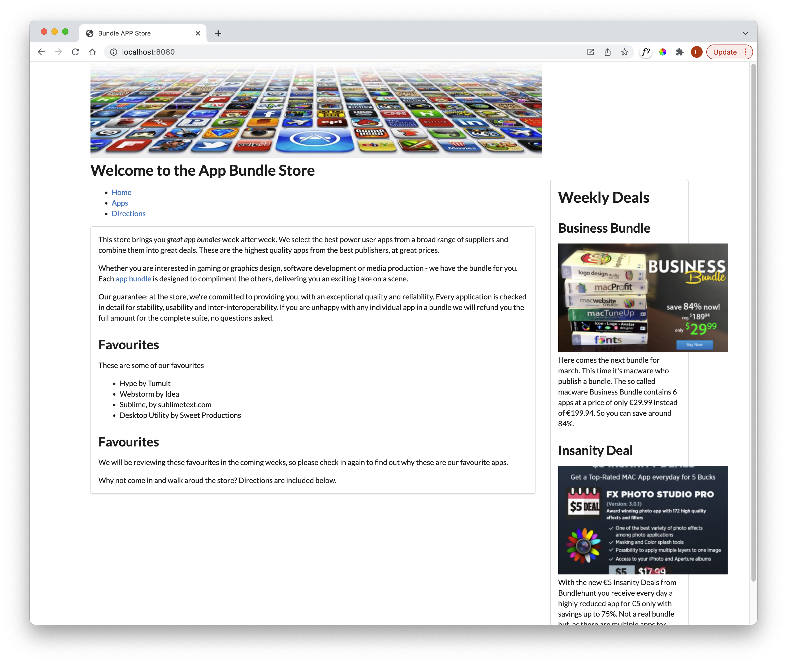
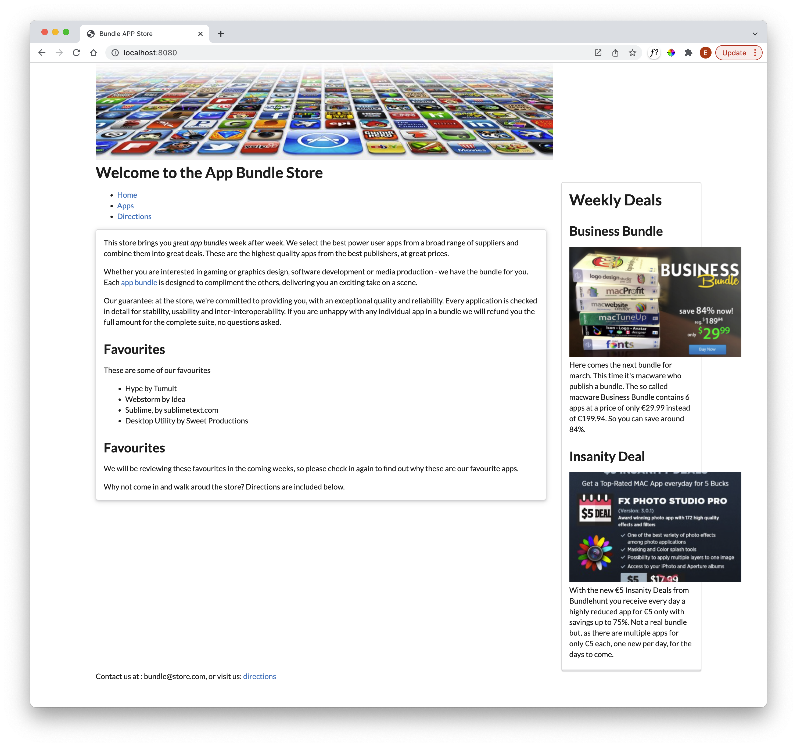

# Segment

In the framework, the segment is a key aspect of proportional layout:

- <https://fomantic-ui.com/elements/segment.html>

In index, we can make the main article a segment:

### index.njk

~~~html
...
<article class="ui segment">
...
~~~

Similarly in the aside:

### sidebar.njk

~~~html
...
<article class="ui segment">
...
~~~

This draws bounding boxes around these sections, with additional padding and margins:

There are many variations to segments presented in detail in the documentation. For instance, the 'stacked' and 'piled' variations:

- <https://fomantic-ui.com/elements/segment.html#raised>

We can make the article 'raised' and the aside 'stacked' just by including the named variant in the class:

~~~html
...
<article class="ui raised segment">
...
<article class="ui stacked segment">
...
~~~

These are subtle differences you will need to look closely to verify (try turning them on and off to see the difference):

