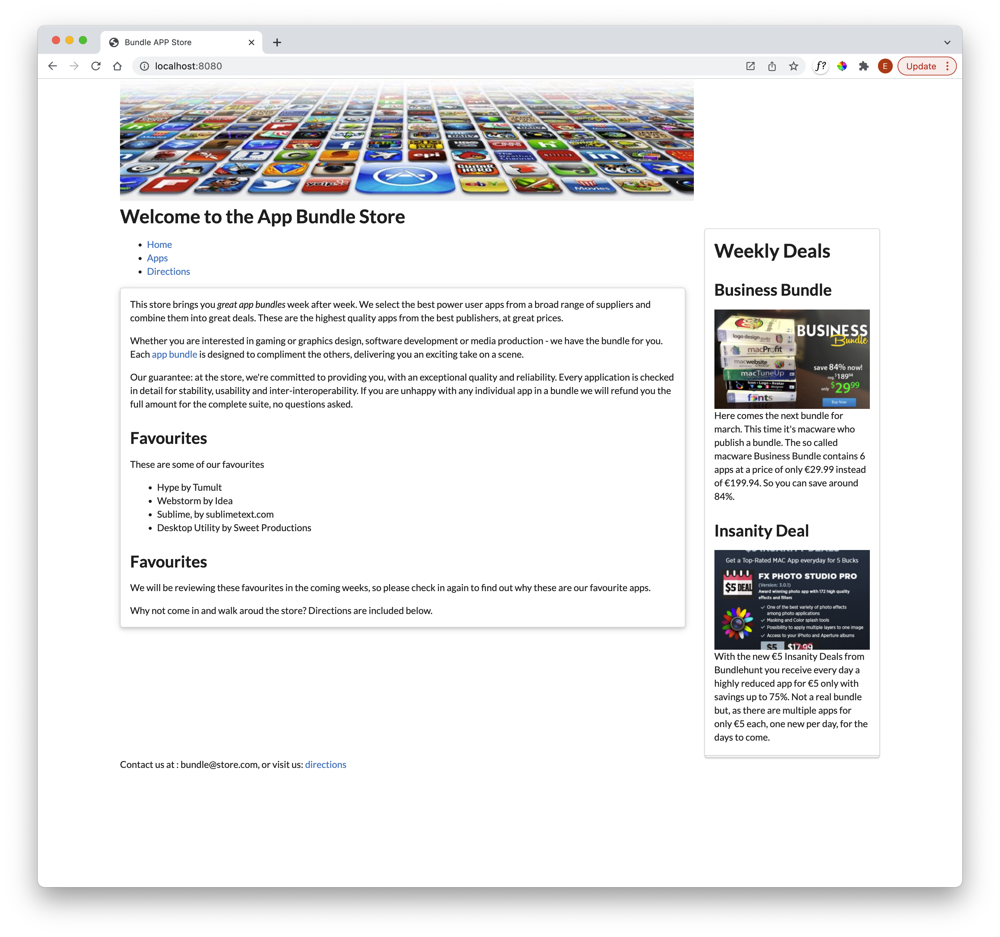
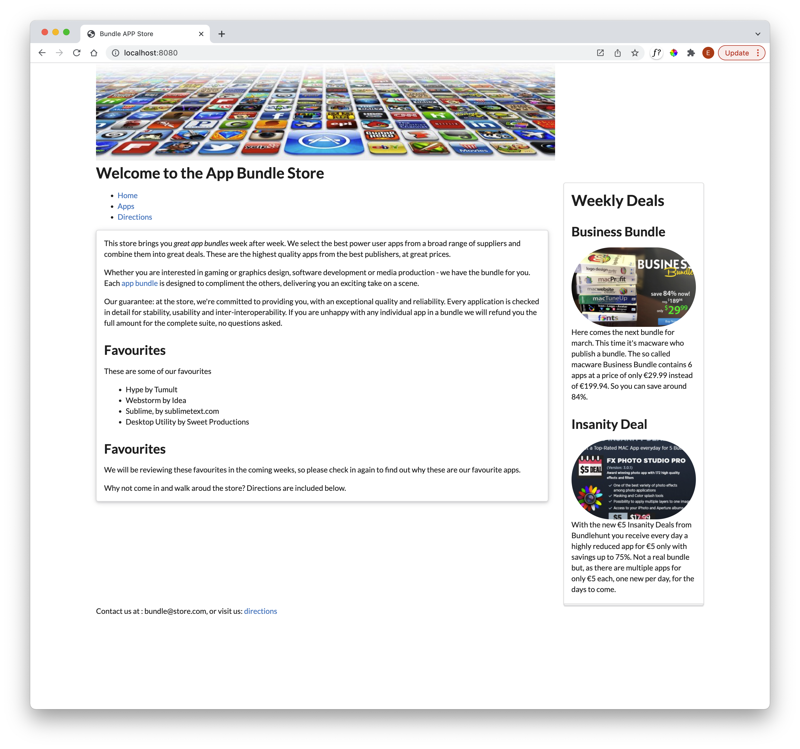

# Images

Currently our images are not being resized proportionally at all. Semantic UI has a range of image features:

- <https://fomantic-ui.com/elements/image.html>

Open the sidebar and extend the image elements to have a new class 'ui image'

### sidebar.njk

~~~html
...
  
...
  With
...
~~~

The images are now resized to something more proportional to the context:

We can also impose some shape on the images:

- <https://fomantic-ui.com/elements/image.html#circular>

Try this:

~~~html
...
  
...
  
...
~~~

