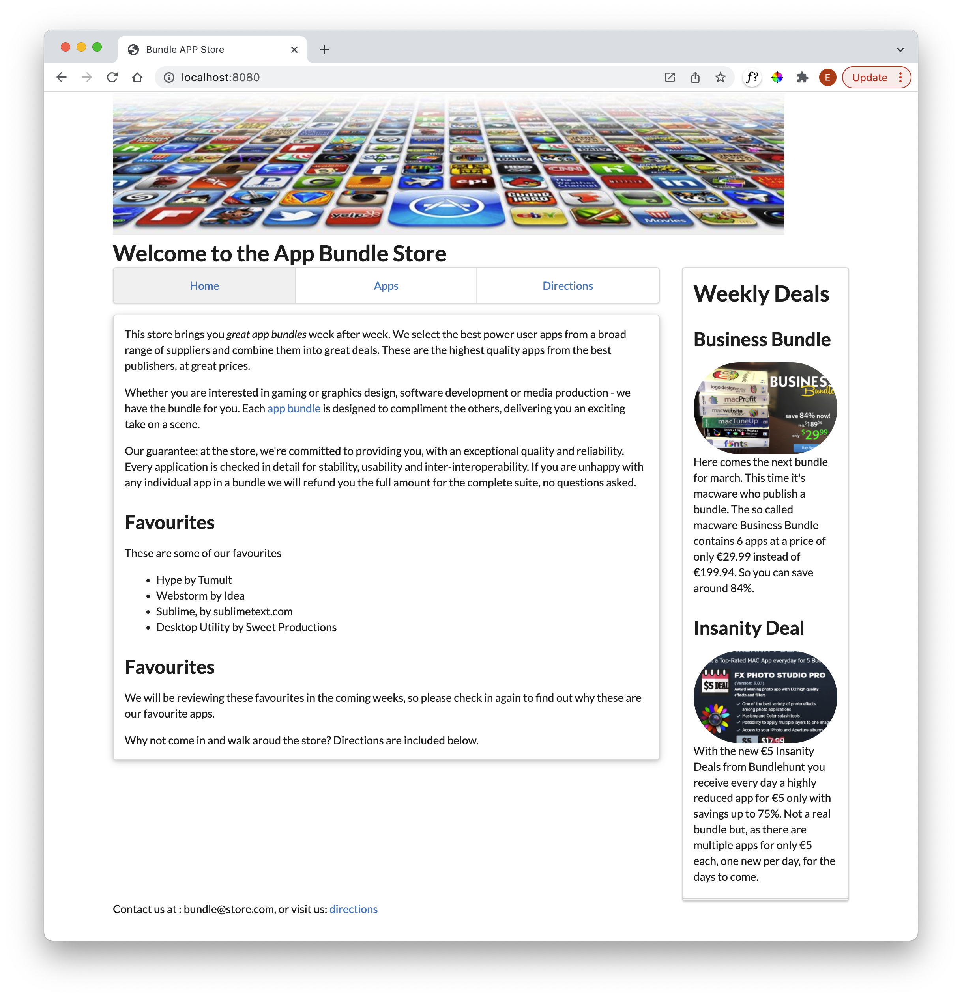

# Menus

Semantic UI includes a comprehensive set of navigation controls. The simplest one to get used to is the menu:

- <https://fomantic-ui.com/collections/menu.html>

Here is a revised version of **nav.njk** which uses this feature:

## nav.njk

~~~html
<nav>
  
  <ul class="ui three item menu">
    
      <li  
            class="ui item active" 
          
            class="ui item" 
          >
        <a href="{{ entry.url | url }}">{{ entry.title }}</a>
      </li>
    
  </ul>
</nav>
~~~

The only changes have been to include new classes in the `<ul>` and `<li>` elements. Try it now:

The navigation should work as before.

The tabular menu might be worth exploring:

- <https://fomantic-ui.com/collections/menu.html#tabular>

~~~html
<nav>
  <ul class="ui three item tabular menu">
~~~

