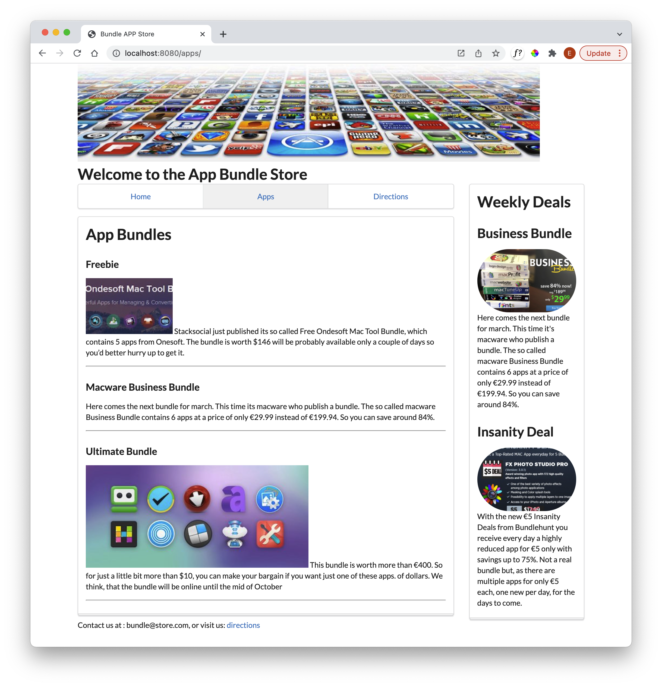
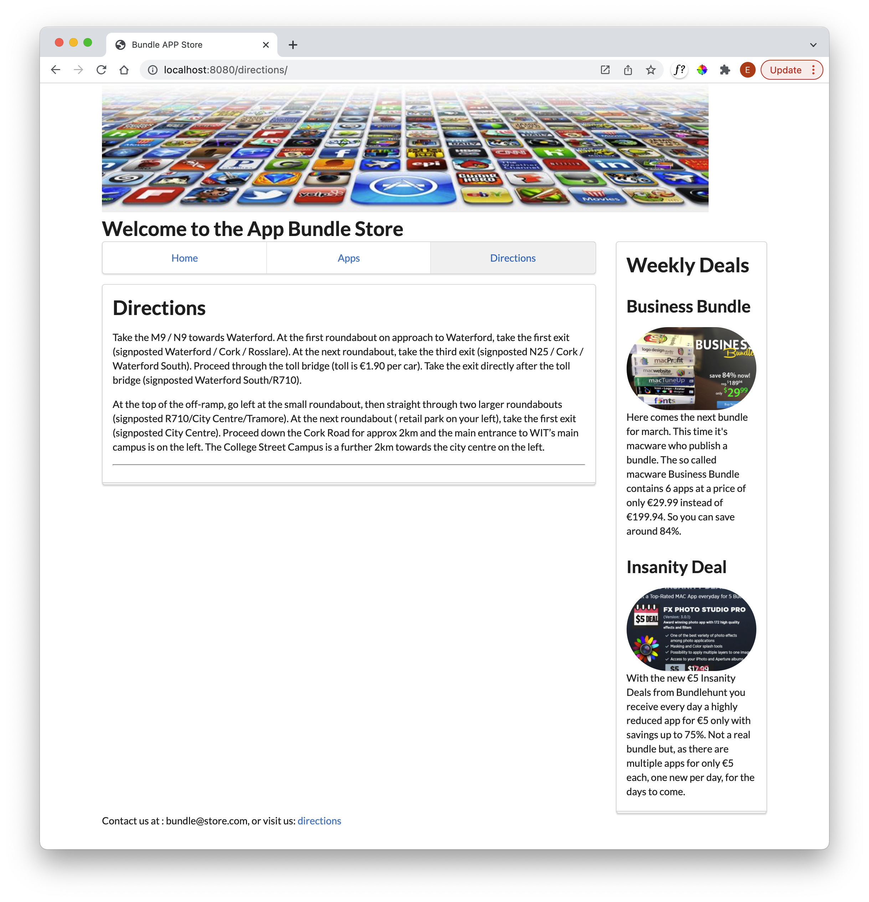

# Solution

This is the project at this stage:

- <https://github.com/wit-hdip-comp-sci-2022/bundle-store/releases/tag/lab07a.end>

### Exercises 1:

Currently the Apps and Directions pages could be improved to also follow the 'raised segment' of the Home page:

### Exercises 2:

Have a look at the Card component:

- <https://fomantic-ui.com/views/card.html>

Could you use this component productively in the sidebar?