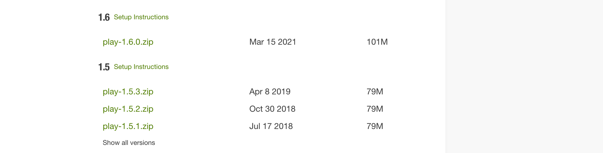
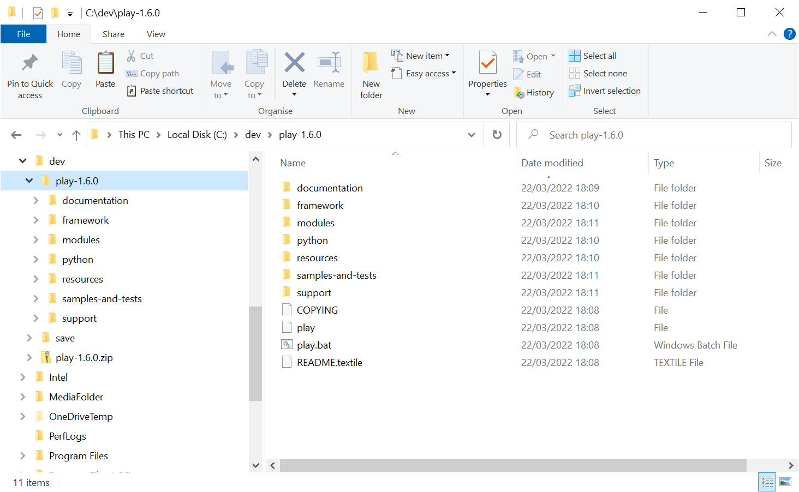
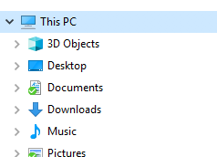
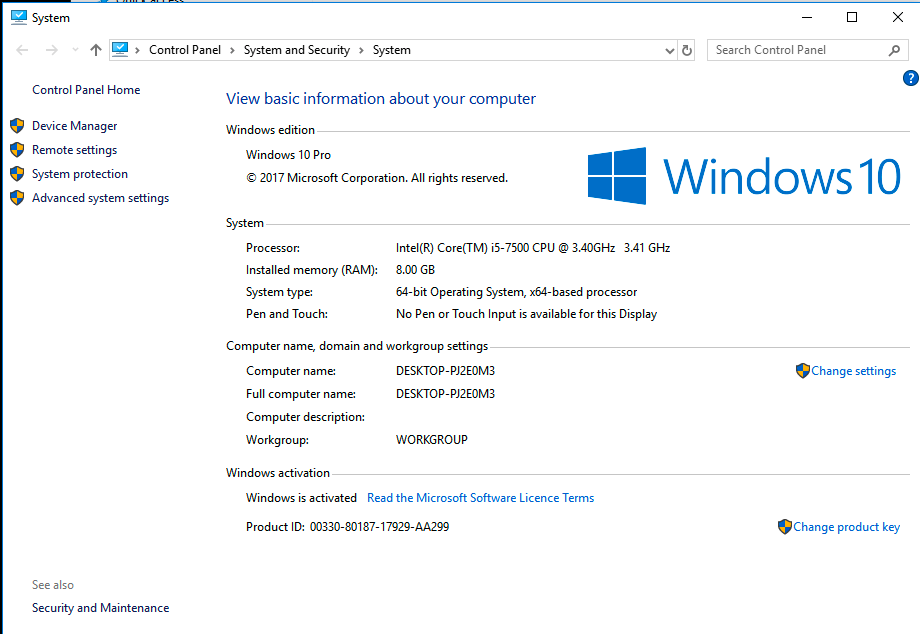
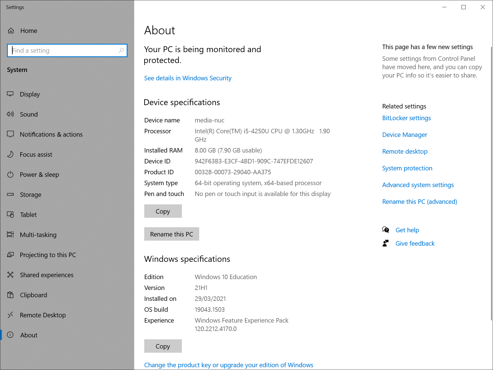
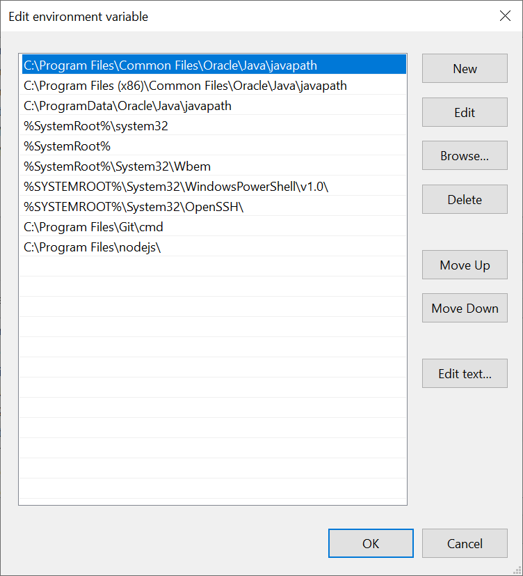
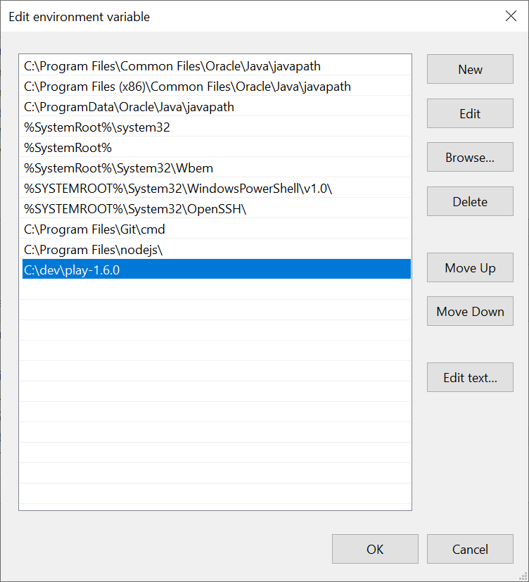

# Installing and Running Play

## JDK & Idea

Before commencing proceeding further, verify that a [JDK](https://www.oracle.com/java/technologies/javase-jdk11-downloads.html) has been installed by entering:

~~~bash
java --version
~~~

We are looking for Java 11:

~~~bash
java 11.0.10 2021-01-19 LTS
Java(TM) SE Runtime Environment 18.9 (build 11.0.10+8-LTS-162)
Java HotSpot(TM) 64-Bit Server VM 18.9 (build 11.0.10+8-LTS-162, mixed mode)
~~~~

Earlier versions will work, but later versions will not. So if you have a version > 11 you will need to reinstall to this version. 

If you do not have Jave 11 installed yet you can download it from here:

- [Windows](https://www.oracle.com/java/technologies/downloads/#java11-windows)
- [Mac](https://www.oracle.com/java/technologies/downloads/#java11-mac)

You will need to register an Oracle account to download. 

Also make sure the [Jetbrains IntelliJ](https://www.jetbrains.com/idea/) Idea application is installed, you should already have this installed for the Programming Fundamentals module. 

## Play Framework

Visit the following site:

- <http://www.playframework.org>

In particular, visit the download page:

- <https://www.playframework.com/releases>

On the this page, select and download **play-1-6.0.zip** (the version number is very important). NoteL we do **not** want version 2 of the framework.

Unzip to somewhere on your workstation.

If you are running a Mac, your instructions are on the next step. However, skim read the instructions below just to get the general context.

## Windows

On windows, a good place to unzip the archive above might the root of the C: drive:

~~~bash
C:\dev
~~~

Once you have unzipped it, the folder might look like this:

In the above, the play archive has been downloaded and expanded in `c:\dev`. Make sure the structure precisely matches the above. A common mistake here is to have `play-1.5.3` nested inside another folder, also called `play-1.5.3`. This won't work, you will need to get the folder to exactly match the above screen shot.

## Windows PATH

We already have commands like `dir` and `cd` available on the windows command line. Recall that in recent labs we installed new commands like  `eleventy`. We would now like to install another new command called `play`. We do this by adding the play folder to the `system path`.

For Windows, you need to do the following: Locate the "This PC" icon in Explorer:

Right click on this and select 'Properties':

Depending on your version of Windows, this will either show this view:

Or you might see:

Either way, locate the  'Advanced System Settings' and select it. You should see:

Select 'Environment Variables':

Under "System Variables" (the bottom list), locate the 'Path' entry and select Edit. Your system will most likely look a little different from the one shown below:

With this view open, press `New` - add a new entry to this list:

~~~bash
C:\dev\play-1.6.0
~~~

This new entry should be the path where play is installed. This should be `C:\dev\play-1.6.0` as in the above example. This assumes you have unzip the play archive in this specific location.

NB: DO NOT DELETE ANY OF THE CURRENT VALUES OF THE PATH!

Press "Ok" all the way back and run a new command prompßt (close any existing one you may have).

In this command prompt, just type "play"  you should see something like this:

~~~bash
~        _            _
~  _ __ | | __ _ _  _| |
~ | '_ \| |/ _' | || |_|
~ |  __/|_|\____|\__ (_)
~ |_|            |__/
~
~ play! 1.6.0, http://www.playframework.org
~
~ Usage: play cmd [app_path] [--options]
~
~ with,  new      Create a new application
~        run      Run the application in the current shell
~        help     Show play help
~~~

Or, if you did not manage to get the play folder on the path, then this command here should work (if you used the recommended folder structure)

~~~bash
C:\dev\play-1.6.0\play
~~~

However, it is best to ensure that the play command is on the system path.

