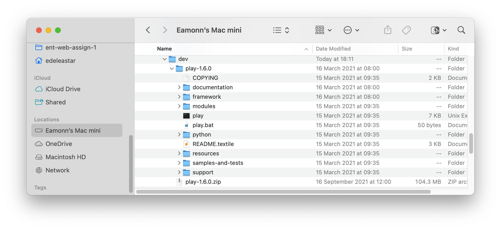
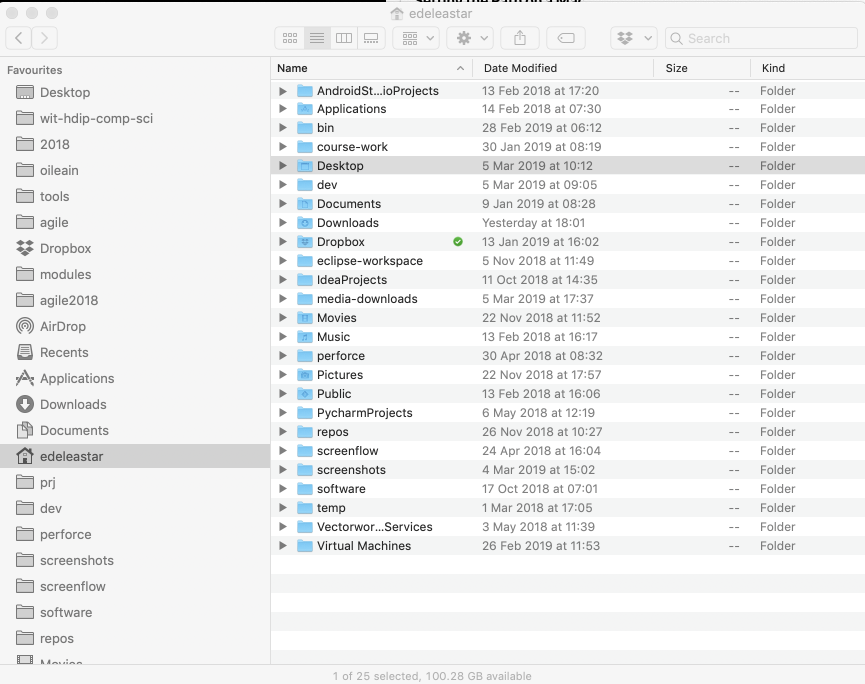
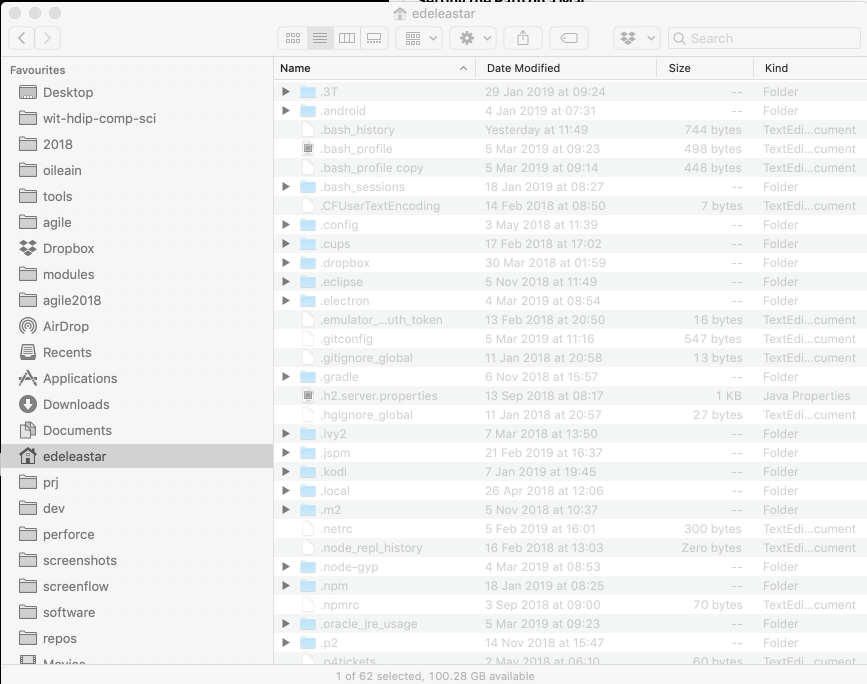

# Bash Shell

On MacOS you have a choice of `shell` languages - i.e. the dialect supported by the terminal prompt. To see which dialects are available. Enter:

~~~bash
cat /etc/shells
~~~

The response will be:

~~~bash
# List of acceptable shells for chpass(1).
# Ftpd will not allow users to connect who are not using
# one of these shells.

/bin/bash
/bin/csh
/bin/dash
/bin/ksh
/bin/sh
/bin/tcsh
/bin/zsh
~~~

Recent versions of MacOS have been set `zsh` as the default. However, for this module (and subsequent modules in the programme), `bash` is more appropriate. To change the use the `bash` shell by default, enter the following:

~~~bash
chsh -s /bin/bash
~~~

You will be asked for your password - and then all future terminals will use the `bash` shell.

## Setting the Path on a Mac

Expand the play archive downloaded in the last step into your home folder. A good location would be into a directory your create called 'dev':

The Mac is completely different to windows of course - but has a similar PATH mechanism that needs to be adjusted. This path can be initialised in a file called `.bash_profile` in the user home folder. 

However, any file starting with a `.` is by default hidden, so the first step is to reveal all of these files:

 - <https://ianlunn.co.uk/articles/quickly-showhide-hidden-files-mac-os-x-mavericks>

The simplest way of doing this is the enter these commands:

 ~~~bash
  CMD + SHIFT + .
 ~~~

Try the above command while your finder is observing your home folder. For example - before revealing hidden files:

... and after revealing hidden files:

Hidden files are displayed in a greyed out font shown above.

One of the revealed files will be may be:

- `.bash_profile`

If the file does not exist - the create is with these contents:

~~~
PATH=$PATH:$HOME/bin:/usr/local/bin:$HOME/dev/play-1.6.0
export PATH
~~~

If it does exist, and if it contains a PATH entry - then append ':$HOME/dev/play-1.6.0' onto the end as shown above.

All of the above assumes you extracted the play archive into the dev folder in your home folder.