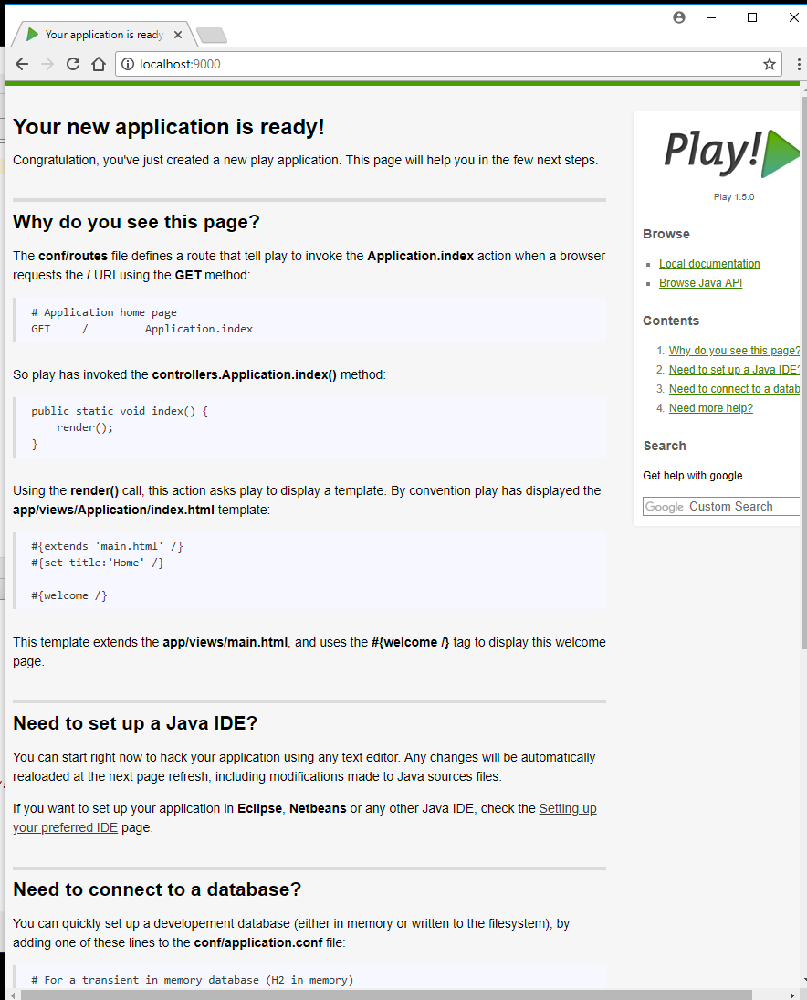

# Running a Play Application

Back in the shell, change into the playdemo folder:

~~~bash
cd playdemo
~~~

 Then type the following command:

~~~bash
play run
~~~

Play will respond with something like this:

~~~bash
~        _            _
~  _ __ | | __ _ _  _| |
~ | '_ \| |/ _' | || |_|
~ |  __/|_|\____|\__ (_)
~ |_|            |__/
~
~ play! 1.6.0, https://www.playframework.com
~
~ Ctrl+C to stop
~
~ using java version "11.0.10"
Listening for transport dt_socket at address: 8000
08:02:25,795 INFO  ~ Starting C:\dev\playdemo
:: loading settings :: url = jar:file:/C:/dev/play-1.6.0/framework/lib/ivy-2.4.0.jar!/org/apache/ivy/core/settings/ivysettings.xml
08:02:26,302 INFO  ~ Module docviewer is available (C:\dev\play-1.6.0\modules\docviewer)
08:02:27,449 WARN  ~ You're running Play! in DEV mode
08:02:27,800 INFO  ~ Listening for HTTP on port 9000 (Waiting a first request to start) ...
~ Server is up and running
~~~

On Windows, you may get a dialog from the firewall, asking for permission to run, which you should agree to.

Now run the browser, and navigate to:

- <http://localhost:9000/>

you should see something like this:

Also notice that a log message will appear in the command window indicating that the app has started:

~~~bash
16:30:58,912 INFO  ~ Application 'playdemo' is now started !
~~~

To stop the application, press "Control+C" in the command prompt.  If you refresh the browser window, then you should now get an error

Start the app again by typing 'play run' as above. Verify that the app has started by browsing/refreshing to:

- <http://localhost:9000/>

Try this a few times to get used to starting/stopping the application