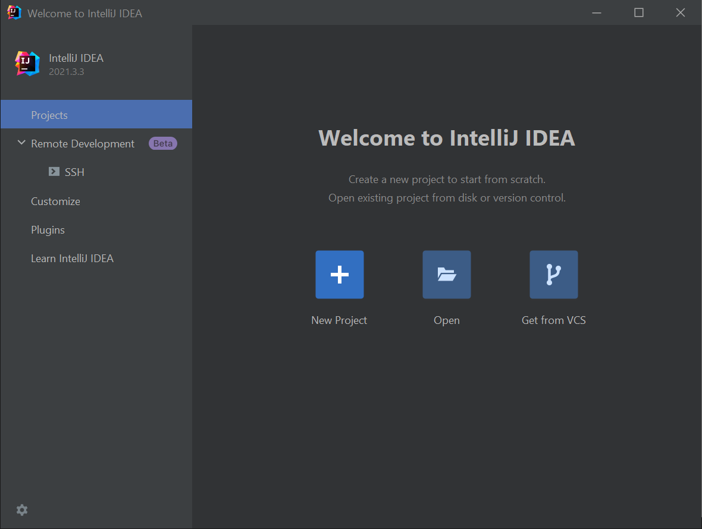
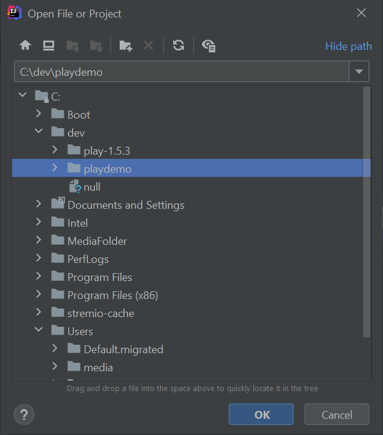
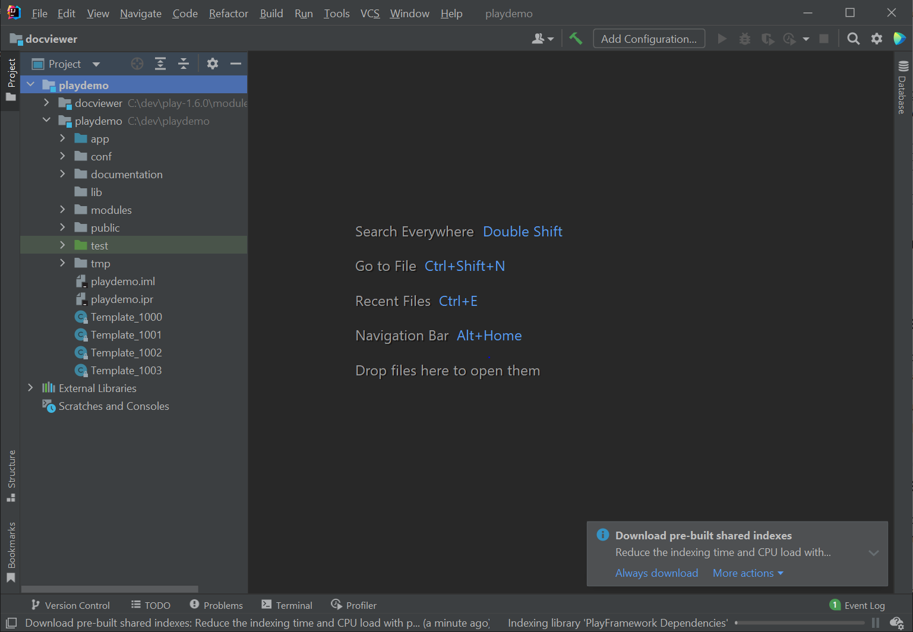
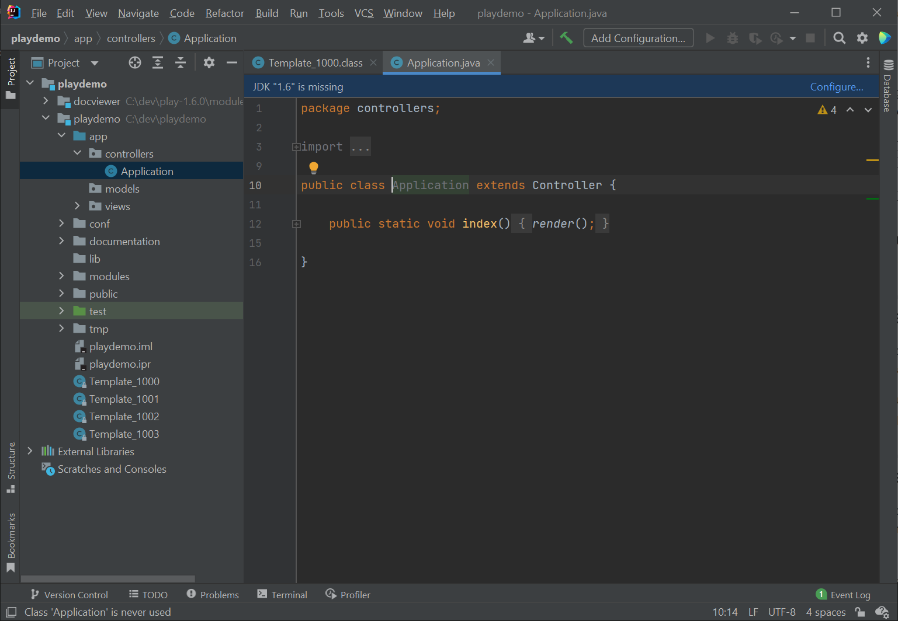
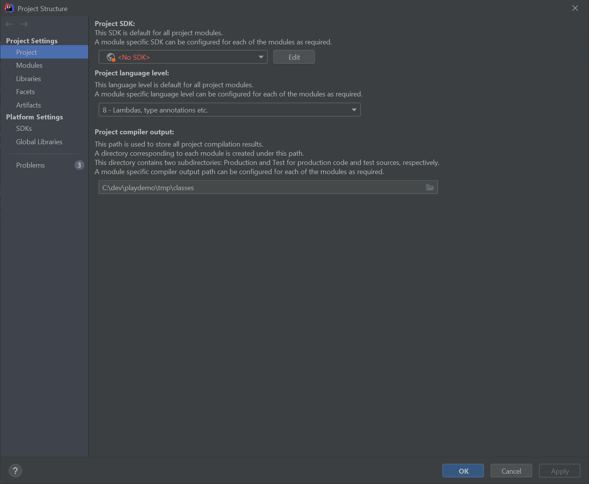
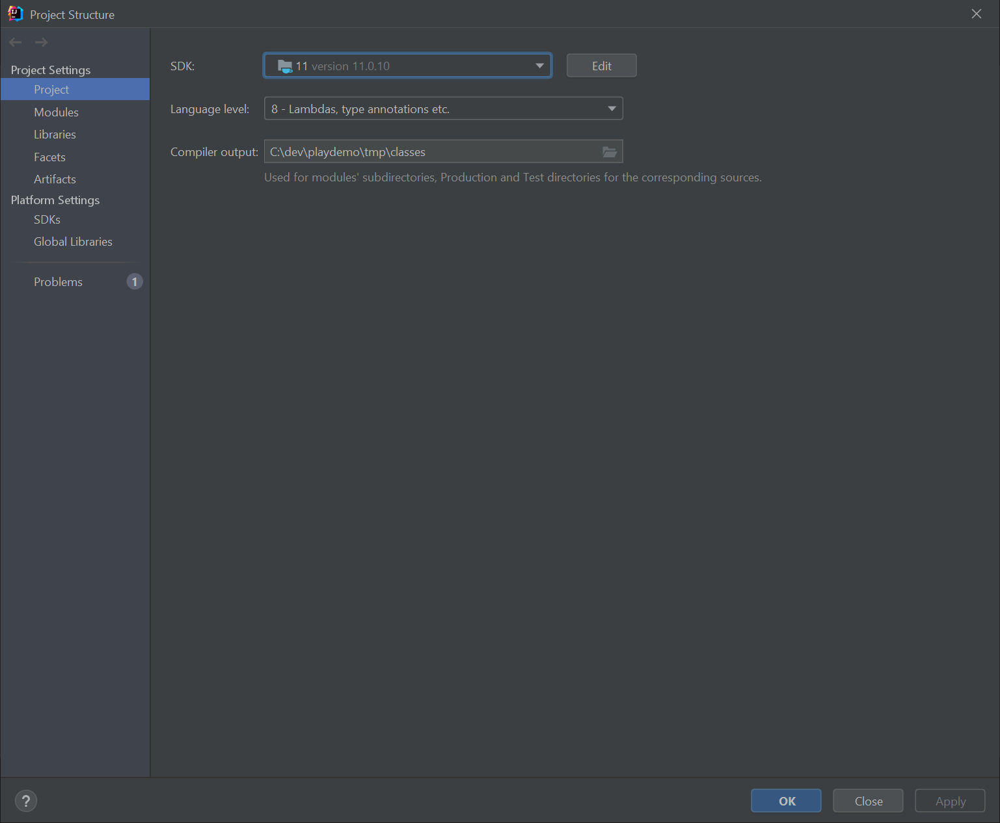
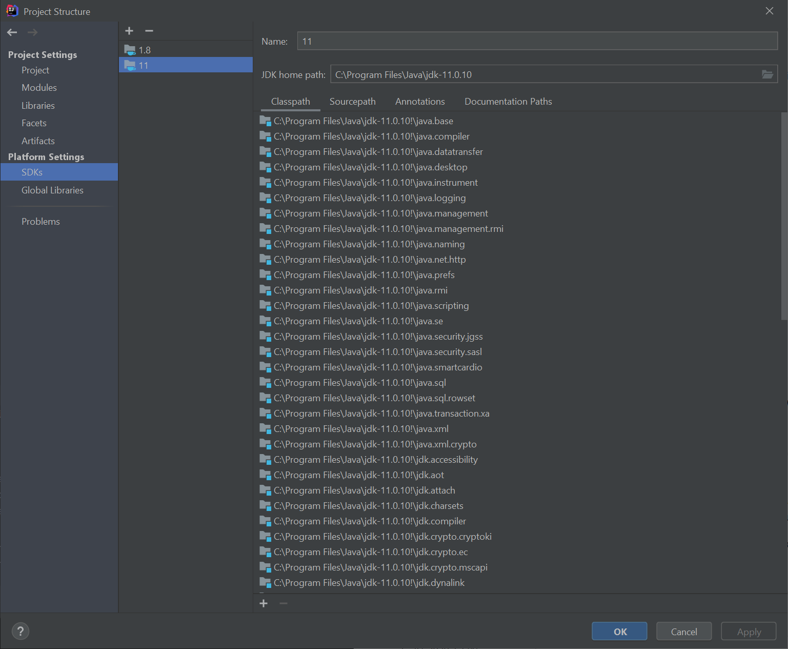

# Import into Idea

Now, making sure you are still in the playdemo folder. This is very important - the command below only works if you are in the project folder. If you are unsure, enter `dir` (or `ls` on Mac) to see where you are.

Then, enter the following command:

~~~bash
play idealize
~~~

The system will respond with:

~~~bash
        _            _
~  _ __ | | __ _ _  _| |
~ | '_ \| |/ _' | || |_|
~ |  __/|_|\____|\__ (_)
~ |_|            |__/
~
~ play! 1.6.0, https://www.playframework.com
~
~ OK, the application is ready for Intellij Idea
~ Use File, Open Project... to open "playdemo.ipr"
~
~~~

Now, launch IntelliJ Idea, and select `Open`:

Navigate to the playdemo folder, and select the project folder to import:

Be sure to select the 'playdemo' only as shown above.

Once opened by Idea, it might look like this:

You may need to press 'project' icon on the left margin - and then expand the project window to reveal the project details. See if you can navigate to and open the Application class:

If it all works as shown above - then you are up and running and you can skip the rest of this step. However, the first time you open a Play project, the JDK may not be set up correctly - and your IDE will look like this:

The errors are visible as `JDK Missing...` on the menu bar. 

To correct this - select the File->Project Structure menu options - showing this dialog:

`No SDK` is highlighted - select JDK-11 from the drop down and press `apply`

On the same dialog - select `SDKs` on the left - and make sure 11 is selected as shown:

Press `Apply` and `close`

If all goes well - we should have the project configured as shown here:

While there are some warnings (4 are highlighted in amber), there should be no errors at this stage.