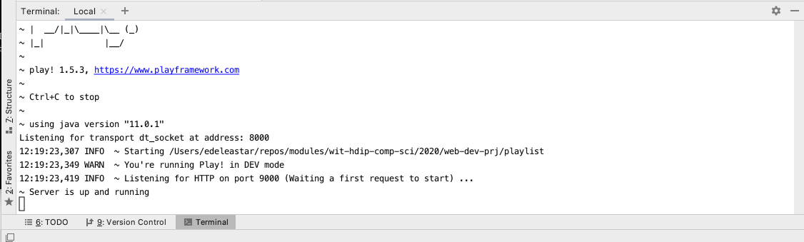
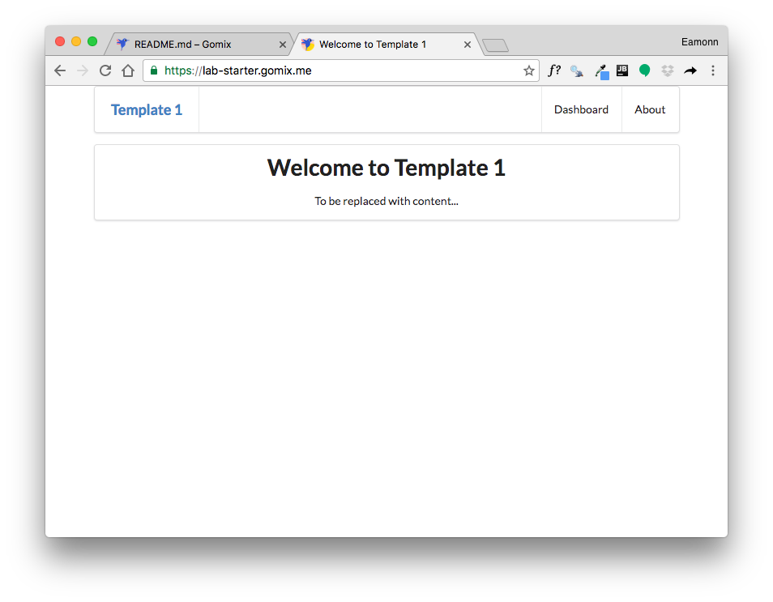
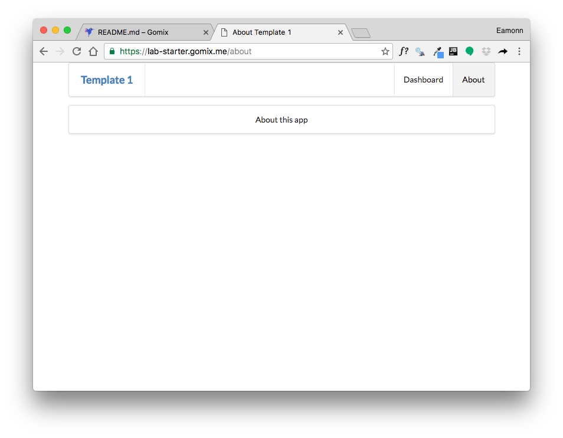

# Running a Play Application

Inside the project folder, enter the following command in the shell/command prompt:

~~~bash
play run
~~~

Which should respond with:

~~~bash
~        _            _
~  _ __ | | __ _ _  _| |
~ | '_ \| |/ _' | || |_|
~ |  __/|_|\____|\__ (_)
~ |_|            |__/
~
~ play! 1.6.0, https://www.playframework.com
~
~ Ctrl+C to stop
~
~ using java version "1.1.XX"
Listening for transport dt_socket at address: 8000
17:50:30,555 INFO  ~ Starting /Users/edeleastar/dev/play-template-1
17:50:30,658 WARN  ~ You're running Play! in DEV mode
17:50:30,760 INFO  ~ Listening for HTTP on port 9000 (Waiting a first request to start) ...
~ Server is up and running
~~~

You can also run this command from within Idea, by activating the terminal:

Navigate now to:

- <http://localhost:9000>

You should see view like these:

To stop the application, enter Ctrl+C in the shell (or inside the terminal in the IDE if you started it from there):

This will stop the application. Try

- <http://localhost:9000>

... and try again, and verify that the app has now stopped.

Practice starting and stopping the app.