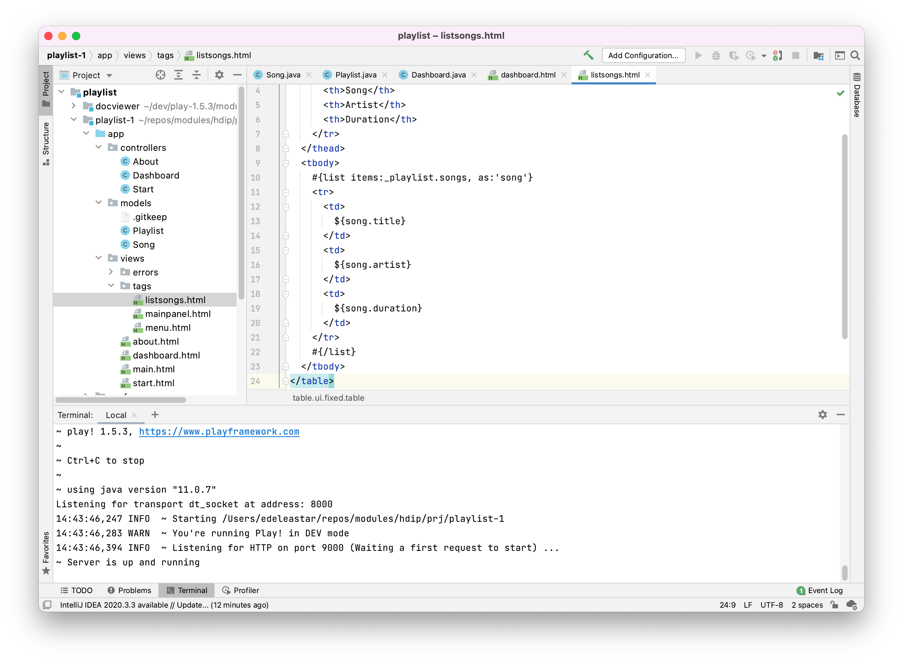
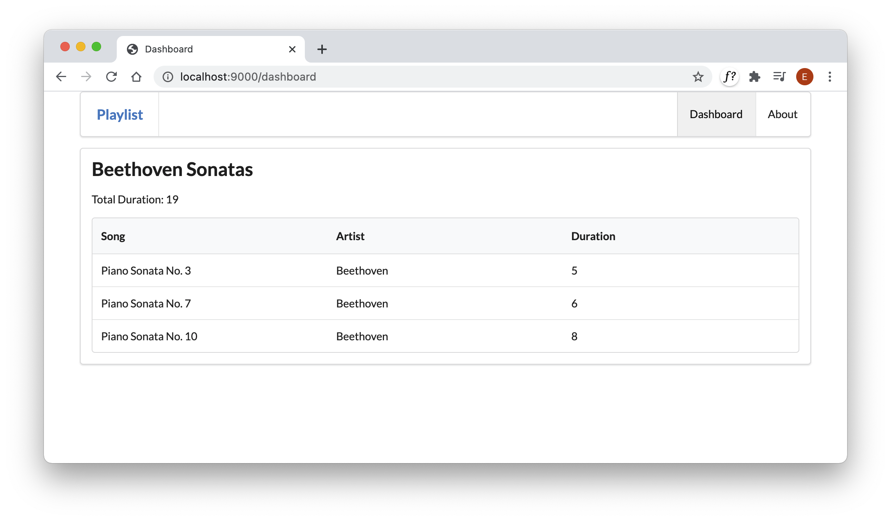

# Exercise Solutions

This is the Playlist application as completed in Lab 08:

- <https://github.com/wit-hdip-comp-sci-2020/playlist/releases/tag/playlist-1.end>

You can use the version of the project you have from that lab. Alternatively, if you would like to start afresh,  you can download the above and use it as the base project for this lab. To do this:

- Download the zip archive referenced above
- Extract the folder - and perhaps rename the folder to something the makes more sense (perhaps playlist-1)
- Open a shell/terminal and make sure you navigate to the extracted folder (you must be inside the folder)
- Run `play idealise`
- Open the projet in Idea

## Exercise 3: New Fields

Extend the song model to also have a `duration` field. Change the constructor to initialise this field. Modify the dashboard view to display it. 

### app/models/song.java

~~~java
package models;

public class Song
{
  public String title;
  public String artist;
  public int duration;
  
  public Song(String title, String artist, int duration)
  {
    this.title = title;
    this.artist = artist;
    this.duration = duration;
  }
}
~~~

Also include a duration field in the Playlist.

### app/models/playlist.java

~~~java
package models;

import java.util.ArrayList;
import java.util.List;

public class Playlist
{
  public String title;
  public List<Song> songs = new ArrayList<Song>();
  public int duration;

  public Playlist(String title, int duration)
  {
    this.title = title;
    this.duration = duration;
  }
}
~~~

Change the `Dashboard.index()` function as follows:

### app/controllers/Dashboard.java

~~~java
  // as before...
  public static void index() { 
    Logger.info("Rendering Dashboard");
    
    Song s1 = new Song("Piano Sonata No. 3", "Beethoven", 5);
    Song s2 = new Song("Piano Sonata No. 7", "Beethoven", 6);
    Song s3 = new Song("Piano Sonata No. 10", "Beethoven", 8);
    Playlist playlist = new Playlist("Beethoven Sonatas", 19);
    playlist.songs.add (s1);
    playlist.songs.add (s2);
    playlist.songs.add (s3);
    
    render ("dashboard.html", playlist);
  }
  //...
~~~

Notice we are passing the new `duration` field in the constructors.

Now modify the dashboard view to display these new fields. First, dashboard:

### app/views/dashboard.html

~~~html
#{extends 'main.html' /}
#{set title:'Dashboard' /}

#{menu id:"dashboard"/}

<section class="ui segment">
  <h2 class="ui header">
    ${playlist.title}
  </h2>
  Total Duration: ${playlist.duration}
  #{listsongs playlist:playlist/}
</section>
~~~

... and then listsongs partial:

### app/views/tags/listsongs.html

~~~html
<table class="ui fixed table">
  <thead>
    <tr>
      <th>Song</th>
      <th>Artist</th>
      <th>Duration</th>
    </tr>
  </thead>
  <tbody>
    #{list items:_playlist.songs, as:'song'}
      <tr>
        <td>
          ${song.title}
        </td>
        <td>
          ${song.artist}
        </td>
        <td>        
          ${song.duration}
        </td>        
      </tr>
    #{/list}
  </tbody>
</table>
~~~

Make sure all files are saved and run the app. You might do this from inside IDEA:

The Dashboard should look like this now:

## Exercise 4: Extend Views

Extend the following views:

- Start: Extend the start view to contain a more detailed outline of the purpose of the application
- About: Extend the about view to provide contact details (may be fictitious) for the author/company that created the app.

## app/views/start.html

~~~html
#{extends 'main.html' /}
#{set title:'Start' /}

#{menu id:"start"/}

<section class="ui center aligned middle aligned segment">
  <h1 class="ui header">
    Welcome to Playlist 1
  </h1> 
  

    A small app to let you compose playlists. This app will allow you to create, manage and share your playlists. Simple enter the playlist details one the dashboard.
  

</section>
~~~

## app/views/about.html

~~~html
#{extends 'main.html' /}
#{set title:'About' /}

#{menu id:"about"/}

<section class="ui center aligned middle aligned segment">
  

    A Little Playlist Maker - Version 1. Prepared by Playlist Solutions, Playlist Mansions, PlaylistTown.
  

</section>
~~~

If the app is already running, you should be able to change the above files, and refresh the corresponding views in the running app (without restarting the app). In general, if you are just adjusting the views/partials you don't need to restart. However, if you are editing the Java source, you may need to restart to be sure you are running the correct version. Restart by entering `Ctrl-C`in the terminal, and then entering `play run` again.
