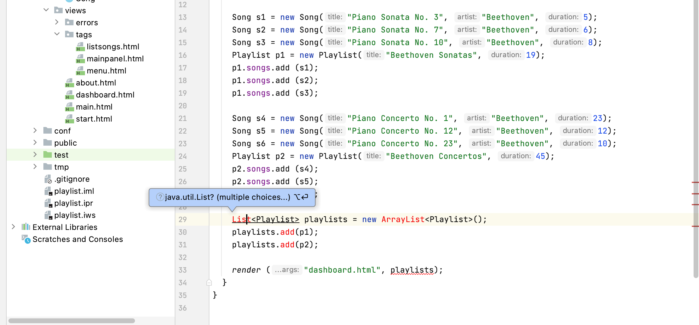
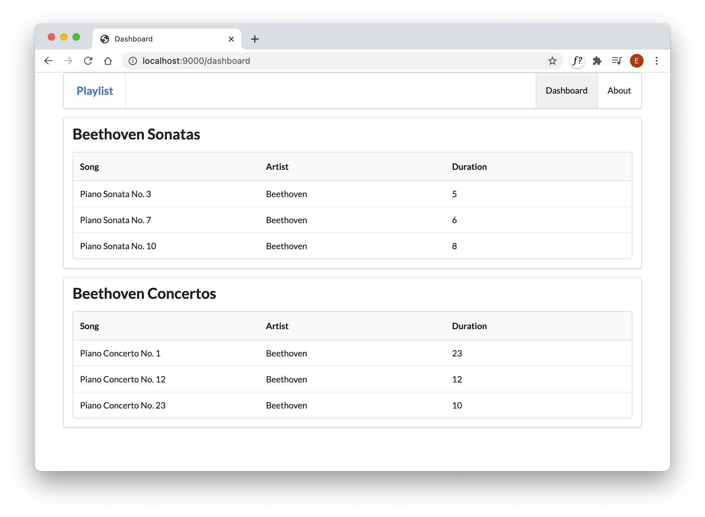

# Multiple playlists

Here is a revised Dashboard index method:

## app/controllers/dashboard.java

~~~java
...
  public static void index() {
    Logger.info("Rendering Dashboard");
    
    Song s1 = new Song("Piano Sonata No. 3", "Beethoven", 3);
    Song s2 = new Song("Piano Sonata No. 7", "Beethoven", 5);
    Song s3 = new Song("Piano Sonata No. 10", "Beethoven", 10);
    Playlist p1 = new Playlist("Beethoven Sonatas", 18);
    p1.songs.add (s1);
    p1.songs.add (s2);
    p1.songs.add (s3);

    Song s4 = new Song("Piano Concerto No. 1", "Beethoven", 12);
    Song s5 = new Song("Piano Concerto No. 12", "Beethoven", 10);
    Song s6 = new Song("Piano Concerto No. 23", "Beethoven", 8);
    Playlist p2 = new Playlist("Beethoven Concertos", 30);
    p2.songs.add (s4);
    p2.songs.add (s5);
    p2.songs.add (s6);
    
    List<Playlist> playlists = new ArrayList<Playlist>();
    playlists.add(p1);
    playlists.add(p2);
    
    render ("dashboard.html", playlists);
  }
...
~~~

The above code will have errors - unless you import these libraries at the top next to the other imports:

~~~java
import java.util.ArrayList;
import java.util.List;
~~~

Before pasting in the above code - try to use the Idea autocorrect feature in insert them automatically:

Notice that we are now creating 2 playlists:`p1` and `p2`. Each of these contains 3 songs. Read this code carefully and try to visualise the data structures.

Here is a new version of the dashboard view:

## app/views/dashboard.html

~~~html
#{extends 'main.html' /}
#{set title:'Dashboard' /}

#{menu id:"dashboard"/}

#{list items:playlists, as:'playlist'}
  <section class="ui segment">
    <h2 class="ui header">
      ${playlist.title} 
    </h2>
    Duration: ${playlist.duration}
    #{listsongs playlist:playlist/}
  </section>
#{/list}
~~~

Browse the dashboard app now - and you should see the two views:

See if you can follow the logic from the controller to the view:

~~~java
...
    render ("dashboard.html", playlists);
...
~~~

Then in the view - a loop iterating over the playlists 

~~~html
#{list items:playlists, as:'playlist'}
  ...
  ...
#{/list}
~~~

... and finally in `listsongs.html`, iterating over each song in a single playlist:

~~~html
    ...
    #{list items:_playlist.songs, as:'song'}
      ...
      ...
    #{/list}
    ...
~~~

This is a complex flow from java into one template... then into another. How the data is passing from java to a view and then to the partials will take some time to get used to, so don't worry if it feels very strange at this stage.