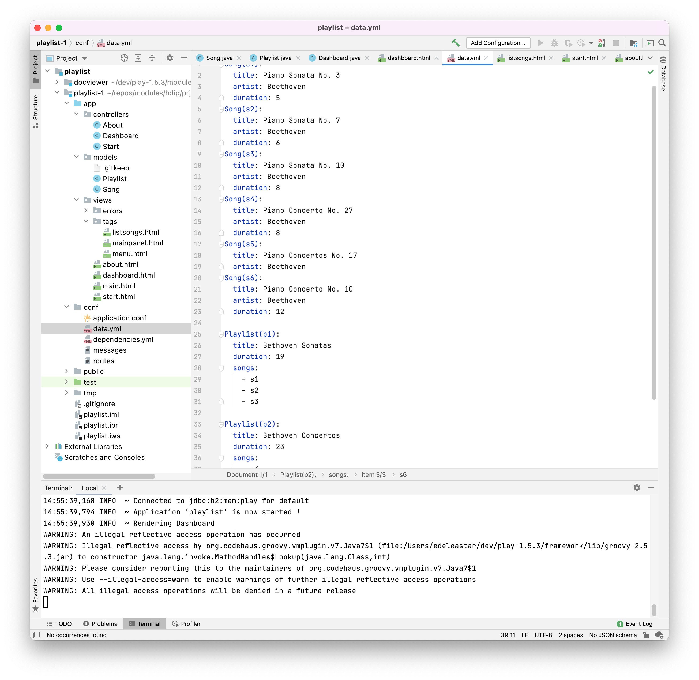

# data.yml

Create a new file in the `conf` folder of the Playlist project called `data.yml`. Here are its contents:

## conf/data.yml

~~~yaml
Song(s1):
  title: Piano Sonata No. 3
  artist: Beethoven
  duration: 5
Song(s2):
  title: Piano Sonata No. 7
  artist: Beethoven
  duration: 6
Song(s3):
  title: Piano Sonata No. 10
  artist: Beethoven
  duration: 8  
Song(s4):
  title: Piano Concerto No. 27
  artist: Beethoven
  duration: 8
Song(s5):
  title: Piano Concertos No. 17
  artist: Beethoven
Song(s6):
  title: Piano Concerto No. 10
  artist: Beethoven
  duration: 12    
  
Playlist(p1):
  title: Bethoven Sonatas
  duration: 19
  songs:
  - s1
  - s2
  - s3
  
Playlist(p2):
  title: Bethoven Concertos
  duration: 23
  songs:
  - s4
  - s5
  - s6  
~~~

The project will look like this now:

This is a YAML file - a notation for describing configuration data and structure information:

- <https://en.wikipedia.org/wiki/YAML>

We will use this to describe initial values for our model objects.

## Bootstrap

Create a new class in the `app` package containing this code here:

~~~java
import java.util.List;

import play.*;
import play.jobs.*;
import play.test.*;
 
import models.*;
 
@OnApplicationStart
public class Bootstrap extends Job 
{ 
  public void doJob()
  {
    Fixtures.loadModels("data.yml");
  }
}
~~~

Do this be selecting the `app` package, and then selecting `New->Java Class`

Creating the class:

The class should be in the `app` package:

