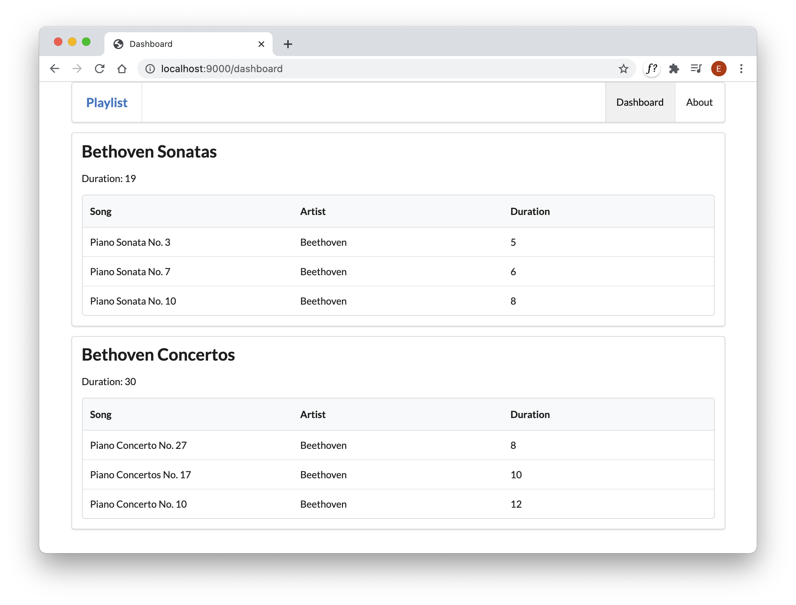

# Load from Database

To display the playlist from the database - here is a revised version of the dashboard controller:

## app/controllers/Dashboard.java

~~~java
package controllers;

import java.util.ArrayList;
import java.util.List;

import models.Playlist;
import models.Song;
import play.Logger;
import play.mvc.Controller;

public class Dashboard extends Controller
{
  public static void index() 
  {
    Logger.info("Rendering Admin");
    
    List<Playlist> playlists = Playlist.findAll();
    render ("dashboard.html", playlists);
  }
}
~~~

Restart the project - and visit the Dashboard view. You should see the playlists in data.yml rendered to the view. 

Notice in the above we are requesting all playlists from the database:

~~~java
    List<Playlist> playlists = Playlist.findAll();
~~~

Before sending them to the view.

Change some values in the `data.yml` file, restart the app, and verify that your updated data is appearing as expected.