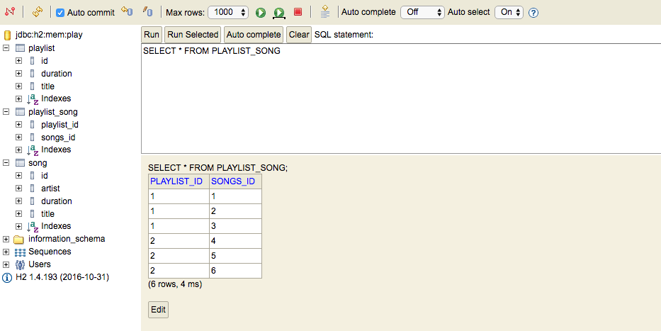

# Database

With your application still running - visit the following url:

- `http://localhost:9000/@db`

This should display this panel:

Please note - the first time your run this `JDBC URL`  field may be: 

- `jdbc:h2:~/test`. 

If this is the case, change it to 

- `jdbc:h2:mem:play` 

as shown above. You should only need to do this once.

Press `Connect`

This is a control panel for the database our application is using. This databases is 'transient' - only containing values while it is running. When the application is terminated, the database is wiped.

However, it is a complete Relational Database - you will be exploring this type of system in semester 2.

Select 'song' in the panel in the left - and the press the green 'play' button:

This has queried the play table - and displayed the full contents.

Try inspecting the other tables:

Can you make sense of these tables - and relate them to the Java model classes? In particular, can you see the role of the playlist_song table? Inspect the contents closely, paying attention to the IDs.