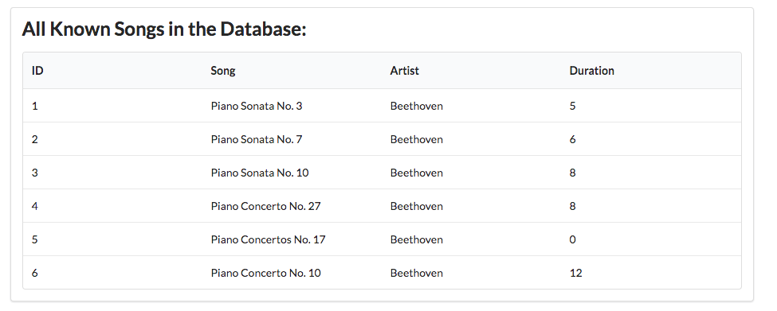

# Exercises 

## Exercise 1: Download and Rename Sample Solution

A complete version of the app as it should be at the end of this lab:

- <https://github.com/wit-hdip-comp-sci-2020/playlist/releases/tag/playlist-2.end>

However, if you already have a project called 'playlist' in Idea, then it might be confusing So, first rename the project to `playlist-2` (covered in step 1 of lab07b), and then run this command:

~~~
play idealize
~~~

... and then open with Idea.

## Exercise 2: New Playlist

Working only in the data.yml, create a new Playlist. If this works correctly, you should see the playlist in the dashboard just by restarting the application.

## Exercise 3: Admin Panel (Challenging)

This is a challenging exercise - but the hints provide most of what you need. The solution is in the next lab - is feel free to go straight to the next lab now if you are stuck for time.

Problem: We would like an 'admin' interface to the application, which displays all the songs in the database - ignoring the playlists they belong to for the moment. The view should also display the IDs of the songs:

This is a 'hidden' view, that does not appear in the menu. It is accessed by browsing directly to:

- <http://localhost:9000/admin>

## Hints:

You will need a new route in `routes` file in `conf`

~~~
GET     /admin                                  Admin.index
~~~

... and a matching controller + view:

## Admin Controller

~~~java
package controllers;

import java.util.ArrayList;
import java.util.List;

import models.Playlist;
import models.Song;
import play.Logger;
import play.mvc.Controller;

public class Admin extends Controller
{
  public static void index() 
  {
    Logger.info("Rendering Admin");

    // TODO - get list of all songs, and send them to the view
    render ("admin.html");
  }
}

~~~

## Admin view

~~~html
#{extends 'main.html' /}
#{set title:'Dashboard' /}

#{menu id:"admin"/}

  <section class="ui segment">
  <h2 class="ui header">
    All Known Songs in the Database:
  </h2>
  <table class="ui fixed table">
    <thead>
      <tr>
        <th>ID </th>
        <th>Song</th>
        <th>Artist</th>
        <th>Duration</th>
      </tr>
    </thead>
    <tbody>

      // TODO Iterate through a list of songs and populate rows in the table.

    </tbody>
  </table>
</section>
~~~

## Even more Hints!

How to read all songs form the Songs table:

~~~java
    List<Song> songs = Song.findAll();
~~~

How to iterate through a list of songs:

~~~html
       ...
      #{list items:songs, as:'song'}
         ...
         ...
      #{/list}
       ...
~~~

How to get the songs from the controller to the view:

~~~java
...
  render("admin.html", songs);
...
~~~

The solution to this exercise is provided in the next lab - but try to have a go first before working through the solution.
