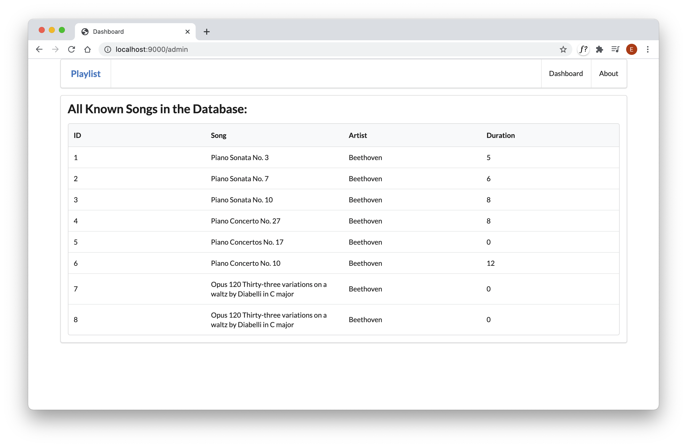

# Exercise Solutions

You can start this lab with the same project as Lab09a - or you can download the solution to that lab and use that solution as the starting point.

## Exercise 2: New Playlist

Working only in the data.yml, create a new Playlist. If this works correctly, you should see the playlist in the dashboard just by restarting the application.

## Solution

This is a revised version of `data.yml` with an additional set of songs + a playlist.

### conf/data.yml

~~~yaml
Song(s1):
  title: Piano Sonata No. 3
  artist: Beethoven
  duration: 5
Song(s2):
  title: Piano Sonata No. 7
  artist: Beethoven
  duration: 6
Song(s3):
  title: Piano Sonata No. 10
  artist: Beethoven
  duration: 8  
Song(s4):
  title: Piano Concerto No. 27
  artist: Beethoven
  duration: 8
Song(s5):
  title: Piano Concertos No. 17
  artist: Beethoven
Song(s6):
  title: Piano Concerto No. 10
  artist: Beethoven
  duration: 12    
Song(s7):
  title: Opus 120 Thirty-three variations on a waltz by Diabelli in C major
  artist: Beethoven
Song(s8):
  title: Opus 120 Thirty-three variations on a waltz by Diabelli in C major
  artist: Beethoven
  
Playlist(p1):
  title: Bethoven Sonatas
  duration: 19
  songs:
  - s1
  - s2
  - s3
  
Playlist(p2):
  title: Bethoven Concertos
  duration: 23
  songs:
  - s4
  - s5
  - s6  
  
Playlist(p3):
  title: Beethoven Variations
  duration: 26
  songs:
  - s7
  - s8
~~~

## Exercise 2:

We would like an 'admin' interface to the application, which displays all the songs in the database - ignoring the playlists they belong to for the moment. The view should also display the IDs of the songs. This is a 'hidden' view, that does not appear in the menu. It is accessed by browsing directly to:

- <http://localhost:9000/admin>

### Solution

Insert this new route int the routes file:

## conf/routes

~~~markdown
GET     /admin                                  Admin.index
~~~

Insert this just below the `/about` route

This is a new view:

## views/admin.html

~~~html
#{extends 'main.html' /}
#{set title:'Dashboard' /}

#{menu id:"admin"/}

  <section class="ui segment">
  <h2 class="ui header">
    All Known Songs in the Database:
  </h2>
  <table class="ui fixed table">
    <thead>
      <tr>
        <th>ID </th>
        <th>Song</th>
        <th>Artist</th>
        <th>Duration</th>
      </tr>
    </thead>
    <tbody>
      #{list items:songs, as:'song'}
        <tr>
          <td>
            ${song.id}
          </td>
          <td>
            ${song.title}
          </td>
          <td>
            ${song.artist}
          </td>
          <td>        
            ${song.duration}
          </td>        
        </tr>
      #{/list}
    </tbody>
  </table>
</section>
~~~

This is a new controller:

## controllers/Admin.java

~~~java
package controllers;

import java.util.List;

import models.Song;
import play.mvc.Controller;

public class Admin extends Controller
{
  public static void index() {
   List<Song> songs = Song.findAll();
   render ("admin.html", songs);
  }
}
~~~

Restart the app now, and load this page:

- <http://localhost:9000/admin>

This should look like this:

