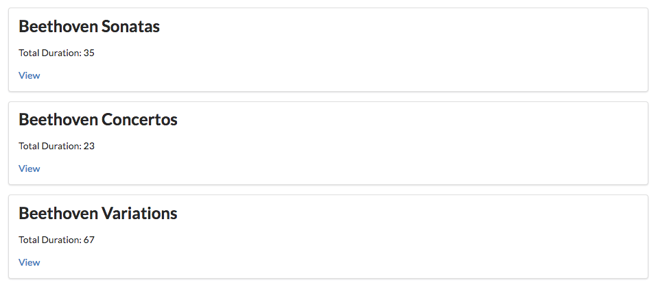
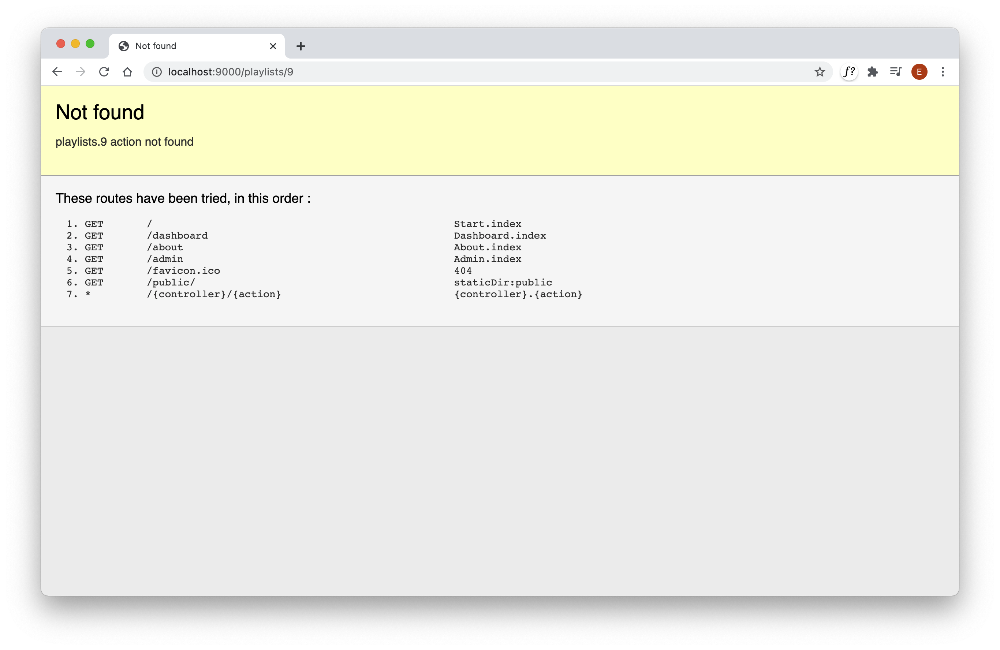

# Playlist Summary

We would like to change the app to just display a list of playlists on the dashboard, not the complete contents of each playlist. Replace the current dashboard with the following:

## views/dashboard.html

~~~html
#{extends 'main.html' /}
#{set title:'Dashboard' /}

#{menu id:"dashboard"/}

#{list items:playlists, as:'playlist'}
  <section class="ui segment">
    <h2 class="ui header">
      ${playlist.title} 
    </h2>
      
 Total Duration: ${playlist.duration} 

    <a href="#"> View </a>
  </section>
#{/list}
~~~

This will render like this:

The `view` links are currently inert (try them):

~~~html
  <a href="#"> View </a>
~~~

We would like them to cause a new view to be rendered, containing the playlist concerned. Each playlist has an ID generated by the database, which can make this convenient to implement. Here is a new version of the `view` link:

## views/dashboard.html

~~~html
      <a href="/playlists/${playlist.id}"> View </a>
~~~

With this change in place, try hovering over each view link (without pressing it). In Chrome, keep an eye on the status bar which should show a the link including the id:

Hover over each link and note how the ID changes. Clicking on any link causes the following error:

We need a new controller to display a new view containing the playlist details. We will do this in the next step.
