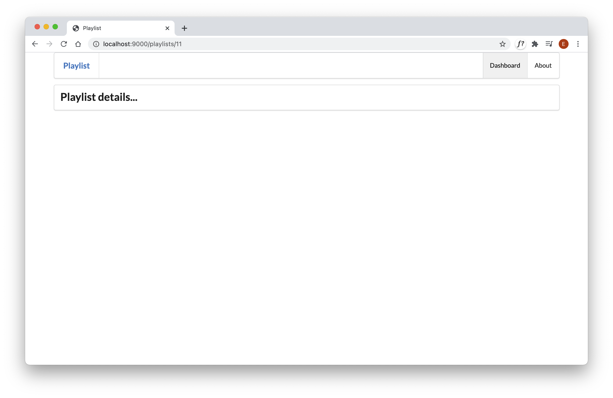

# Controller/View/Route

We have a new pattern `/playlist/id`, which we would like to route to a controller that would render a new view detailing the playlist contents:

## views/dashboard.html

~~~html
...
      <a href="/playlist/${playlist.id}"> View </a>
...
~~~

Supporting a new link link this usually requires three things:

- a controller
- a view
- a route

Here is is the new controller:

## app/controllers/PlaylistCtrl.java

~~~java
package controllers;

import java.util.List;

import models.Playlist;
import models.Song;
import play.mvc.Controller;

public class PlaylistCtrl extends Controller
{
  public static void index(Long id)
  {
    render("playlist.html");
  }
}
~~~

This will render a view called `playlist`. This is the playlist view (for the moment):

## app/views/playlist.html

~~~html
#{extends 'main.html' /}
#{set title:'Playlist' /}

#{menu id:"dashboard"/}

<section class="ui segment">
  <h2 class="ui header">
    Playlist details...
  </h2>
</section>
~~~

Finally, the route:

## conf/routes

~~~markdown
GET     /playlists/{id}                         PlaylistCtrl.index
~~~

Notice that the route includes this segment: `{id}`. This means it matches any route that includes an extra wildcard segment at the end.

Implement all of the above now and restart the application.Verify that the view is rendered as expected. i.e. when we click on a 'View' link we see something like this:

