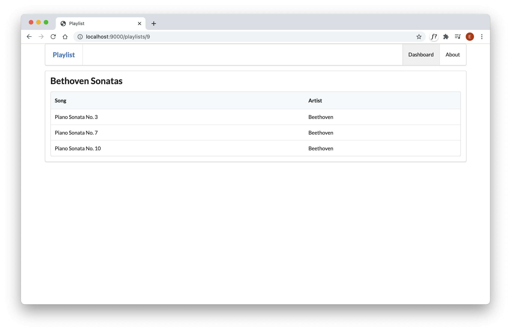

# Playlists

In order to display the correct playlist, we need to extract the id from the url and then fetch the playlist from the model. Modify the playlist controller as follows:

~~~java
package controllers;

import java.util.List;

import models.Playlist;
import models.Song;
import play.Logger;
import play.mvc.Controller;

public class PlaylistCtrl extends Controller
{
  public static void index(Long id)
  {
    Playlist playlist = Playlist.findById(id);
    Logger.info ("Playlist id = " + id);
    render("playlist.html", playlist);
  }
}
~~~

The `id` from the route is passed as a parameter to the method. We use this id to get the correct playlist object:

~~~
    Playlist playlist = Playlist.findById(id);
    Logger.info ("Playlist id = " + id);
~~~

Run the app and select each of the playlist links in turn. The logs will display each of the Ids as you select the playlist. A different id should be logged for each. The console should contain something like this:

~~~bash
12:16:02,580 INFO  ~ Rendering Dashboard
12:16:04,872 INFO  ~ Playlist id = 10
12:16:14,450 INFO  ~ Playlist id = 11
12:17:16,606 INFO  ~ Playlist id = 9
~~~

Check the database to verify that these IDs are correct:

- <http://localhost:9000/@db>

Occasionally, you may see an error like this:

When this occurs - restart the application (Ctrl-C and the `play run` again). We will fix this occasional error later.

Here is a revised version of the Playlist view:

## app/views/playlist.html

~~~html
#{extends 'main.html' /}
#{set title:'Playlist' /}

#{menu id:"dashboard"/}

<section class="ui segment">
  <h2 class="ui header">
    ${playlist.title}
  </h2>
  <table class="ui table">
    <thead>
      <tr>
        <th>Song</th>
        <th>Artist</th>
      </tr> 
    </thead>
    <tbody>
    #{list items:playlist.songs, as:'song'}
      <tr>
        <td>
          ${song.title}
        </td>
        <td>
          ${song.artist}
        </td>
      </tr>
    #{/list}
    </tbody>
  </table>
</section>
~~~

Rerun the app now and verify that you can view each playlist. Typically it might look like this:

We alrady have a `listsongs.html` partial:

## app/views/tags/listsongs.html

~~~html
<table class="ui fixed table">
  <thead>
    <tr>
      <th>Song</th>
      <th>Artist</th>
      <th>Duration</th>
    </tr>
  </thead>
  <tbody>
    #{list items:_playlist.songs, as:'song'}
      <tr>
        <td>
          ${song.title}
        </td>
        <td>
          ${song.artist}
        </td>
        <td>        
          ${song.duration}
        </td>        
      </tr>
    #{/list}
  </tbody>
</table>
~~~

We could change the Playlist controller to call this to do the work of building the song table. Replace the playlist with this version:

## app/views/playlist.html

~~~html
#{extends 'main.html' /}
#{set title:'Playlist' /}

#{menu id:"dashboard"/}

<section class="ui segment">
  <h2 class="ui header">
    ${playlist.title}
  </h2>
  #{listsongs playlist:playlist /}
</section>
~~~

Verify that all of this works as expected - i.e. no change from the previous version.

This last step is a little challenging to understand fully - particularly how the listsongs.html partial is parameterised by the playlist passed from playlist.html. Look carefully at these templates for a minute and try to absorb the syntax.

