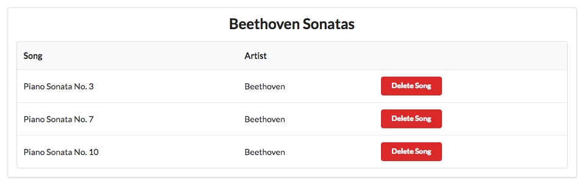

# Deleting Songs 1

Having a playlist app, without the ability to create/delete songs or playlists is clearly very limited. We have, essentially, an app that allows us to `Read` our models, but not `Create`, `Update` or `Delete` elements of the model.

We can start with providing a facility to delete songs from individual playlists. Our view will need to look like this:

and pressing the delete button should remove the corresponding song.

Any new button/link/action on our page requires:

- an new button element in the view for each song
- a route matching the new button element
- a matching controller method

.. and it may also involve some interaction with the model.

# View

The new button must appear in each song row. Here is a revised listsongs partial:

## app/views/tags/listsongs.html

~~~html
<table class="ui fixed table">
  <thead>
    <tr>
      <th>Song</th>
      <th>Artist</th>
      <th>Duration</th>
      <th></th>
    </tr>
  </thead>
  <tbody>
    #{list items:_playlist.songs, as:'song'}
      <tr>
        <td>
          ${song.title}
        </td>
        <td>
          ${song.artist}
        </td>
        <td>        
          ${song.duration}
        </td>      
         <td>
            <a href="/playlists/${_playlist.id}/deletesong/${song.id}" class="ui tiny red button">Delete Song</a>
         </td>         
      </tr>
    #{/list}
  </tbody>
</table>
~~~

Look at the new element

~~~html
         <td>
            <a href="/playlists/${_playlist.id}/deletesong/${song.id}" class="ui tiny red button">Delete Song</a>
         </td>         
~~~

It is just an `<a>` element - styled to look like a button. The `href` is manufactured to include the ids of both the playlist + the song. So it might be:

~~~html
... href="/playlists/123/deletesong/321" ...
~~~

... where 123 is the id of the playlist, and 321 is the id of the song.

# Route

We now need a new route - containing both the playlist and song id - and linking to a new method in the playlist controller:

## conf/routes

~~~markdown
GET     /playlists/{id}/deletesong/{songid}     PlaylistCtrl.deleteSong
~~~

# Controller

This is the new method in PlaylistCtrl to handle this route:

## app/ontrollers/PlaylistCtrl.java

~~~java
...
  public static void deletesong (Long id, Long songid)
  {
    Playlist playlist = Playlist.findById(id);
    Song song = Song.findById(songid);
    Logger.info ("Removing " + song.title);

    render("playlist.html", playlist);
  }
...
~~~

Try all of this now - and verify that the logs shows the attempt to delete the song when the button is pressed:

~~~markdown
12:23:28,939 INFO  ~ Removing Piano Concerto No. 27
12:23:45,562 INFO  ~ Removing Piano Concertos No. 17
~~~

We havent yet deleted the song - we will leave that to the next step.

To summarise, for every song we are generating a `delete` button. This button's href contains the id of the playlist + the song we want to delete. When the user presses this button, it triggers a call to our new Controller method. This method is then able to locate the playlist/song in the database using the IDs from the route.

