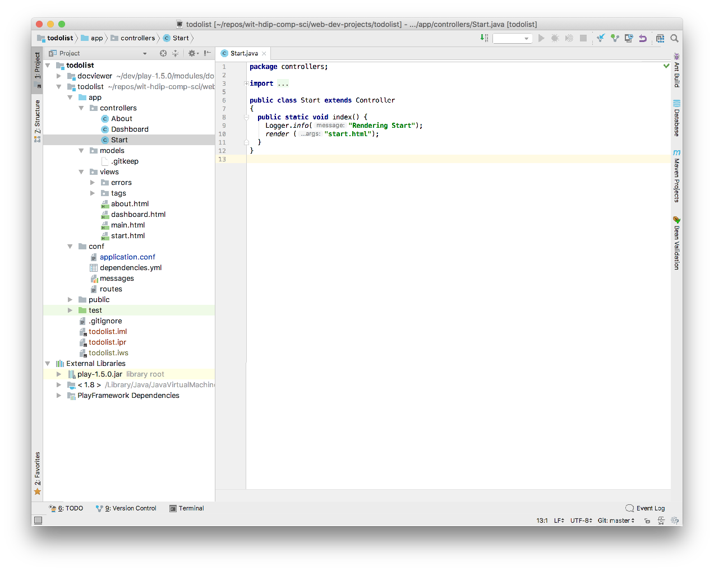

# Create New Application

Each time we start a new application, we will 'clone' a starter app like this:

## Create New Project

Create a new play project using this command:

~~~bash
git clone https://github.com/wit-hdip-comp-sci-2020/play-template-1
~~~

The shell should show something like this:

~~~bash
Cloning into 'play-template-1'...
remote: Counting objects: 66, done.
remote: Compressing objects: 100% (47/47), done.
remote: Total 66 (delta 9), reused 66 (delta 9), pack-reused 0
Unpacking objects: 100% (66/66), done.
~~~

## Rename Project

The default name of the project should be changed now. This will require the following procedure:

- Rename the folder `play-template-1`. Call the folder `todolist` instead.
- Use Sublime Text to edit this file: `playlist/conf/application.conf`. The first three lines contains the following:

    ~~~bash
    # This is the main configuration file for the application.
    # ~~
    application.name=play-template-1
    ~~~

- Change `play-template-1` above to `todolist`, and save the file:

    ~~~bash
    # This is the main configuration file for the application.
    # ~~
    application.name=todolist
    ~~~

## Import into Idea

Still in the shell, and in the project folder enter the following command:

~~~bash
play idealize
~~~

You should get this response:

~~~bash
~        _            _
~  _ __ | | __ _ _  _| |
~ | '_ \| |/ _' | || |_|
~ |  __/|_|\____|\__ (_)
~ |_|            |__/
~
~ play! 1.5.3, https://www.playframework.com
~
~ OK, the application is ready for Intellij Idea
~ Use File, Open Project... to open "todolist.ipr"
~
~~~

Launch Idea eclipse, and select `Open`. Select the todlist folder and presse `Open`. The project should open like this:

Open a command prompt inside the `todolist` folder, and run the app:

~~~
play run
~~~

Verify that the skeleton app is available:

- <http://localhost:9000>

Do not proceed to the next step until the above procedure has been completed without any errors.
