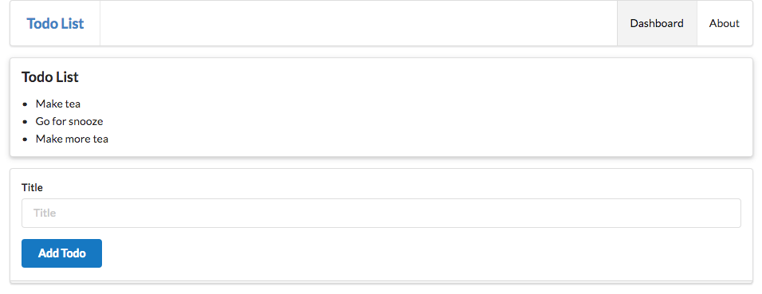

# Static Todo List

Replace the contents of the Dashboard view with the following:

## app/views/dashboard.html

~~~html
#{extends 'main.html' /}
#{set title:'Dashboard' /}

#{menu id:"dashboard"/}

<section class="ui raised segment">
  <header class="ui header">
    Todo List
  </header>
  

    
 Make tea

    
 Go for snooze

    
 Make more tea

  

</section>

<form class="ui stacked segment form" action="/dashboard/addtodo" method="POST">
  

    <label>Title</label>
    <input placeholder="Title" type="text" name="title">
  

  <button class="ui blue submit button">Add Todo</button>
</form>
~~~

Also, change the title in the menu:

## app/views/tags/menu.html

~~~html
<nav class="ui menu">
  <header class="ui header item"> <a href="/"> Todo List </a></header>
  

    <a id="dashboard" class="item" href="/dashboard"> Dashboard  </a>
    <a id="about" class="item" href="/about"> About </a>
  

</nav>

~~~

The Dashboard will look like this:

Notice that the dashboard has a form - with a single text entry - the user can interact with.