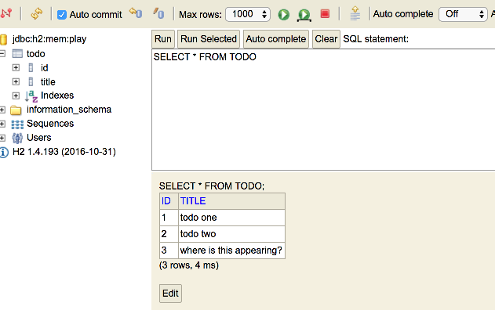

# Add Todo Route + Action

Examine the dashboard form again - particularly the `action` attribute of the `<form>` element:

~~~html
...
<form class="ui stacked segment form" action="/dashboard/addtodo" method="POST">
...
~~~

This is the route we need to support. i.e. we need an entry in our routes file to match this route with a controller method.

Here it is:

## conf/routes

~~~bash
...
POST    /dashboard/addtodo                      Dashboard.addTodo
...
~~~

Add the above to the routes file just under the existing `/dashboard` route.

Now add a new method in Dashboard class to handle the route:

~~~java
  public static void addTodo(String title)
  {
    Todo todo = new Todo(title);
    todo.save();
    Logger.info("Adding Todo" + title);
    redirect("/dashboard");
  }
~~~

Run the application now - and verify that you can add a todo item. The UX will not display them yet however (we still have the static elements). 

We can view them in the database however:

- <localhost:9000/@db>

We should see something like this:

