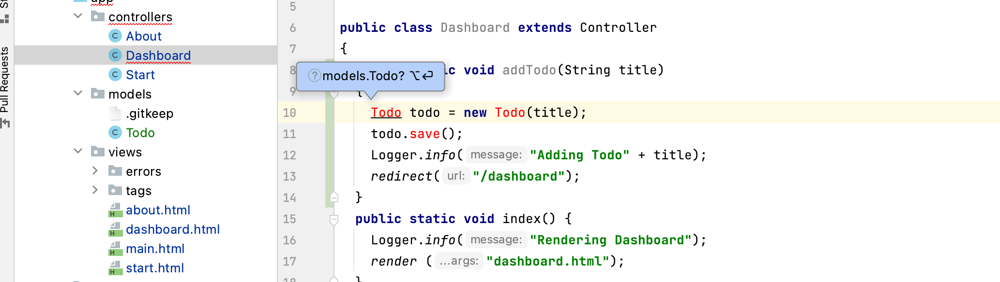

# Todo UX

In order to display the Todos - we need to change the `Dashboard.index()` method such that it fetches all of them from the database, and sends them to the view:

## app/controllers/Dashboard.java

~~~java
  public static void index()
  {
    Logger.info("Rendering Dashboard");
    List<Todo> todolist = Todo.findAll();
    render("dashboard.html", todolist);
  }
~~~

This will require an additional import towards the top of the file:

~~~java
import models.Todo;
~~~

Before inserting the above - see if you can persuade the IDE to generate it for you:

Now we can start to display them in the dashboard view. Replace just the todolist section with the following:

## app/views/dashboard.html

~~~html
...
<section class="ui raised segment">
  <header class="ui header">
    Todo List
  </header>
  

    #{list items:todolist, as:'todo'}
      
 ${todo.title} 

    #{/list}
  

</section>
...
~~~

We have removed the static todo items, and we should now be rendering the todo items as submitted by the user (and stored in the database).

Try adding more todos - and verify that they appear in the list after you press `Add Todo`. Also, verify that you can see them in the database.