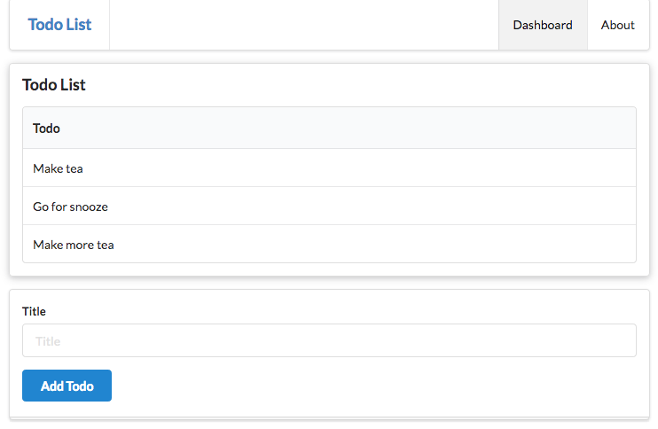

# Exercise 2: Tables

Change the todo view segment in the dashboard view:

## app/views/dashboard.html

~~~html
...
<section class="ui raised segment">
  <header class="ui header">
    Todo List
  </header>
  

  #{list items:todolist, as:'todo'}
    
 ${todo.title} 

  #{/list}
  

</section>
...
~~~

Have them display the todo items in a 2 column table instead of a list. Here is an example of a 2 column table to get you started.  

~~~html
<table class="ui fixed table">
  <thead>
    <tr>
      <th>title 1</th>
      <th>title 2</th>
    </tr>
  </thead>
  <tbody>
    <tr>
      <td> col 1</td>
      <td> col 2 </td>
    </tr> 
  </tbody>
</table>
~~~

The dashboard should look like this:

