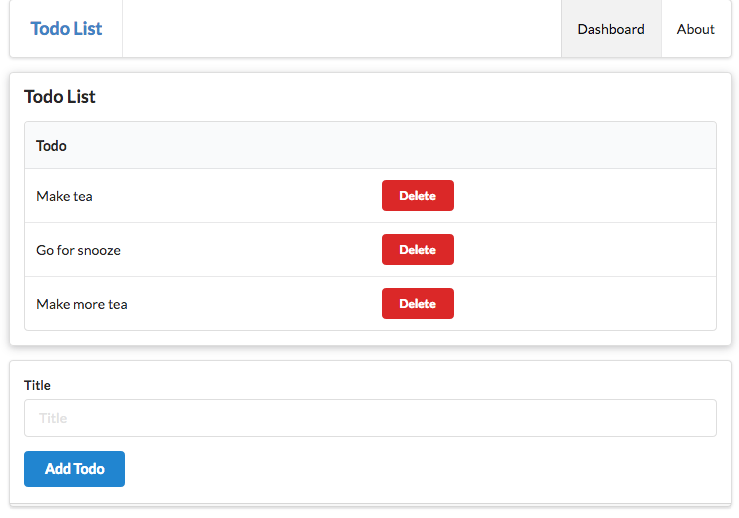

# Exercise 3: Delete button

Include a 'delete' button into the second column of the todo table to look like this:

Examples of various style of buttons here:

- <https://semantic-ui.com/elements/button.html>

Leave the `href` for the button as `#` for the moment.
