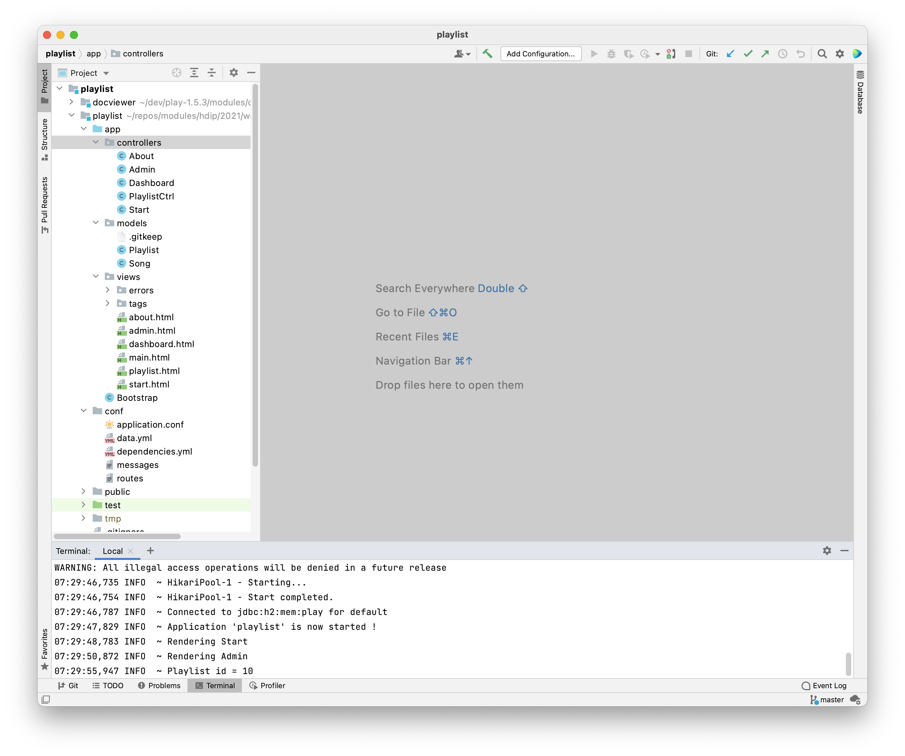
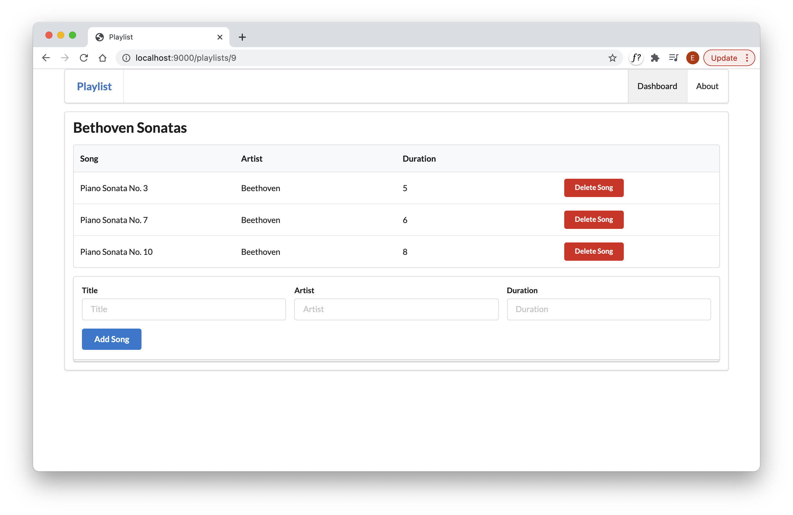
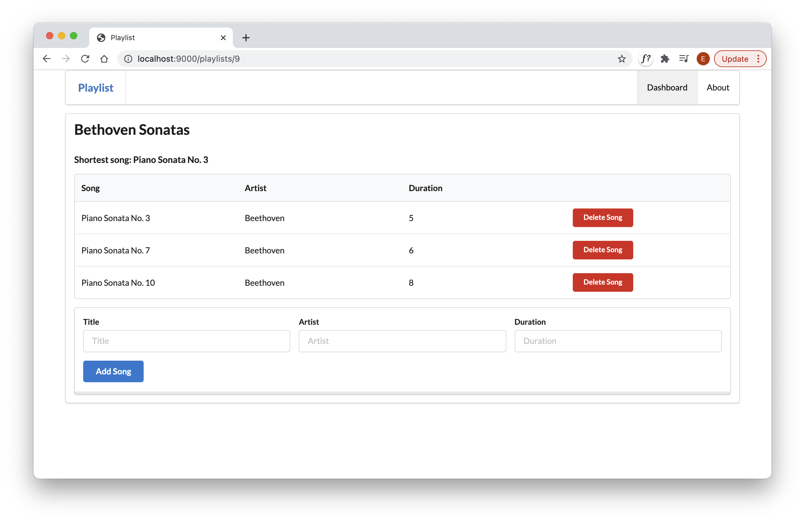

# Feature

Your workspace should look like this:

If we run the application, and open the first playlist we see this:

We would like to develop a feature to display the shortest song along the top like this:

