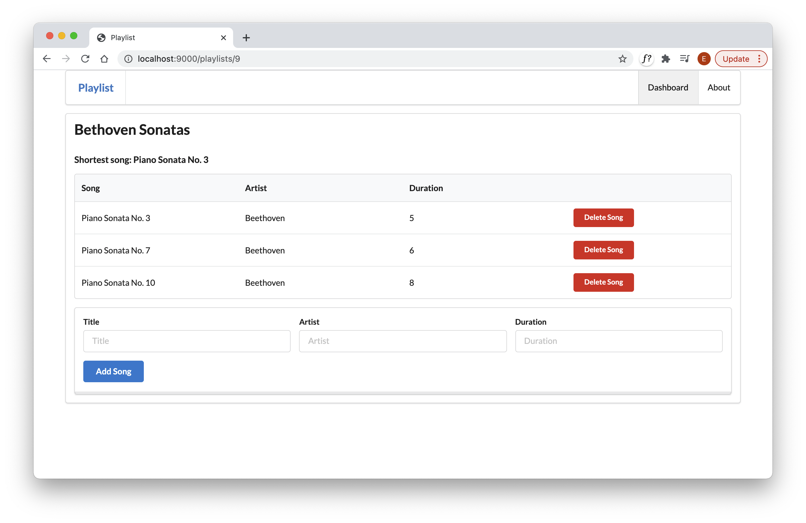

# Update the View

To display the shortest song, we need to pass the data to the view. Change the render method as follows:

~~~java
   render("playlist.html", playlist, shortestSong);
~~~

We can then change playlist.html to display this new information:

### playlist.html

~~~html
#{extends 'main.html' /}
#{set title:'Playlist' /}

#{menu id:"dashboard"/}

<section class="ui segment">
  <h2 class="ui header">
    ${playlist.title}
  </h2>
  <h4> Shortest song: ${shortestSong.title}</h4>
  #{listsongs playlist:playlist /}
  #{addsong playlist:playlist /}
</section>
~~~

We have just added this line:

~~~html
  <h4> Shortest song: ${shortestSong.title}</h4>
~~~

This should render like this:

