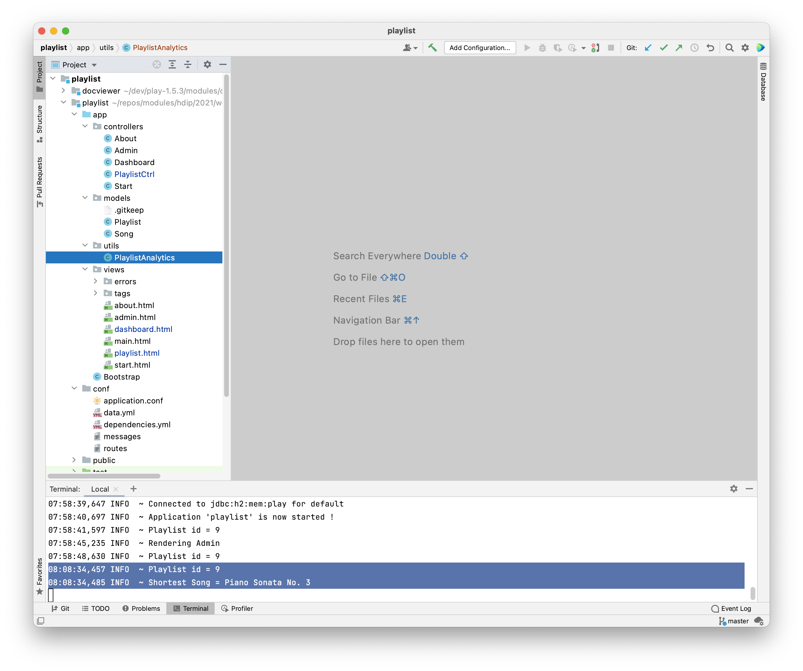

# Utils Pattern

This is our current index method in PlaylistCtrl:

~~~java
  public static void index(Long id)
  {
    Playlist playlist = Playlist.findById(id);
    Logger.info ("Playlist id = " + id);
    Song shortestSong = null;
    if (playlist.songs.size() > 0) {
      shortestSong = playlist.songs.get(0);
      for (Song song : playlist.songs) {
        if (song.duration < shortestSong.duration) {
          shortestSong = song;
        }
      }
    }
    Logger.info("Shortest Song = " + shortestSong.title);
    render("playlist.html", playlist, shortestSong);
  }
~~~

This works fine - but imagine if we had also a need for some other information:

- Total duration
- Longest Song
- Average Duration
- etc...

We could envisage solving each of this problems with a new algorithm - and incorporating the algorithm into the method above. However, this would yield a very long method! Before tacking any of the above, we might decide to move the algorithm out int a utility class:

Create a new `package` called `utils` as a sibling of the controllers and models packages, and create a class `PlaylistAnalytics` in that package:

In this new class, we include the algorithm as a method:

### PlaylistAnalytics

~~~java
package utils;

import models.Song;

import java.util.List;

public class PlaylistAnalytics {
  
  public static Song getShortestSong(List<Song> songs) {
    Song shortestSong = null;
    if (songs.size() > 0) {
      shortestSong = songs.get(0);
      for (Song song : songs) {
        if (song.duration < shortestSong.duration) {
          shortestSong = song;
        }
      }
    }
    return shortestSong;
  }
}
~~~

Note that we pass the song array as a parameter - and return the shortest song.

We can now simplify the Playlist Controller index method:

~~~java
package controllers;

import java.util.List;

import models.Playlist;
import models.Song;
import play.Logger;
import play.mvc.Controller;
import utils.PlaylistAnalytics;

public class PlaylistCtrl extends Controller
{
  public static void index(Long id)
  {
    Playlist playlist = Playlist.findById(id);
    Logger.info ("Playlist id = " + id);
    Song shortestSong = PlaylistAnalytics.getShortestSong(playlist.songs);
    render("playlist.html", playlist, shortestSong);
  }

  ...
}
~~~

In the above, we are just calling the method instead of implementing the algorithm inline. There is no change in the view.

