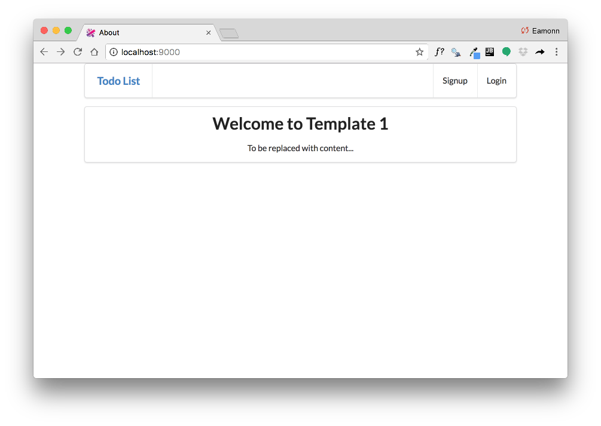

# Views

Assuming you are working from the sample solution - or your own completed todolist - we will start with the View.

# Menus

Replace the existing menu partial with the following:

## app/views/tags/menu.html

~~~html
<nav class="ui menu">
  <header class="ui header item"> <a href="#"> Todo List </a></header>
  

    <a id="dashboard" class="item" href="/dashboard"> Dashboard  </a>
    <a id="about" class="item" href="/about"> About </a>
    <a id="logout" class="item" href="/logout"> Logout </a>
  

</nav>

~~~

Introduce this new menu alongside the existing one:

## app/views/tags/welcomenenu.html

~~~html
<nav class="ui menu">
  <header class="ui header item"> <a href="#"> Todo List </a></header>
  

    <a id="signup" class="item" href="/signup"> Signup  </a>
    <a id="login" class="item" href="/login">  Login   </a>
  

</nav>

~~~ 

## New Views

Bring in these new views:

## app/views/login.html

~~~
#{extends 'main.html' /}
#{set title:'login' /}
#{welcomemenu id:"login"/}

  

    <form class="ui stacked segment form" action="/authenticate" method="POST">
      <h3 class="ui header">Log-in</h3>
      

        <label>Email</label> <input placeholder="Email" name="email">
      

      

        <label>Password</label> <input type="password" name="password">
      

      <button class="ui blue submit button">Login</button>
    </form>
  

  

    
  

~~~

## app/views/signup.html

~~~html
#{extends 'main.html' /}
#{set title:'Signup' /}
#{welcomemenu id:"signup"/}

  

    <form class="ui stacked segment form" action="/register" method="POST">
      <h3 class="ui header">Register</h3>
      

        

          <label>First Name</label>
          <input placeholder="First Name" type="text" name="firstname">
        

        

          <label>Last Name</label>
          <input placeholder="Last Name" type="text" name="lastname">
        

      

      

        <label>Email</label>
        <input placeholder="Email" type="text" name="email">
      

      

        <label>Password</label>
        <input type="password" name="password">
      

      <button class="ui blue submit button">Submit</button>
    </form>
  

  

    
  

~~~

Finally for this step, change one line in the `start.html` view, from this:

~~~
...
#{menu id:"start"/}
...
~~~

to this:

~~~
...
#{welcomemenu id:"start"/}
...
~~~

Save everything now, and make sure that the app launches:

- <http://localhost:9000>

The app should start with a new menu:

However, the menu items will not work yet (try them).

