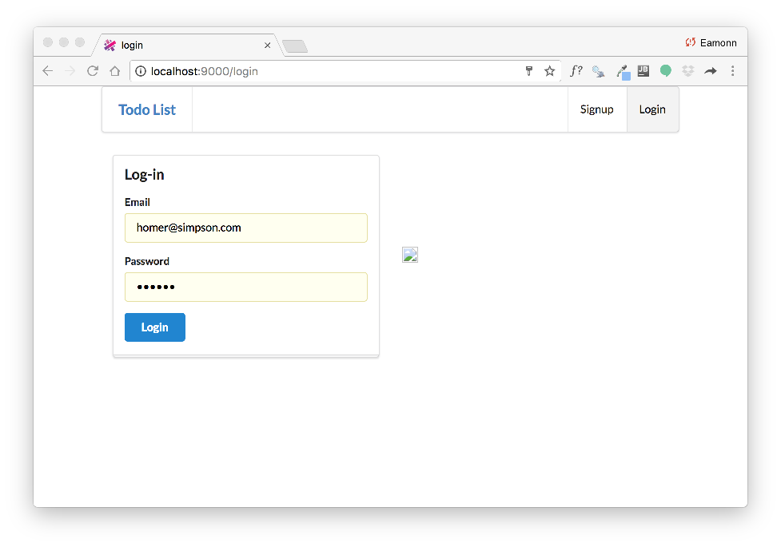
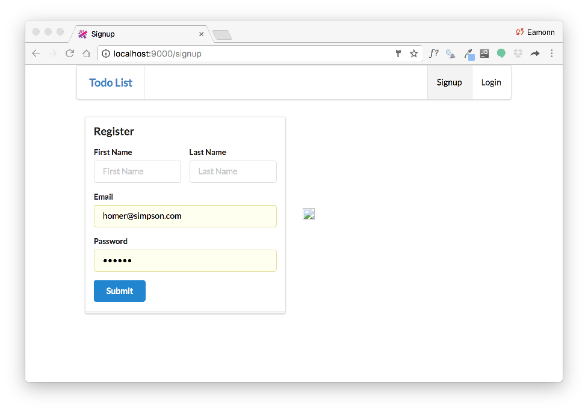
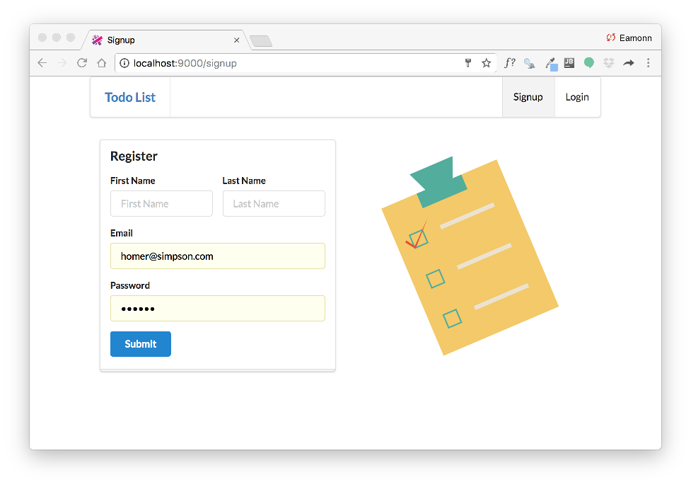
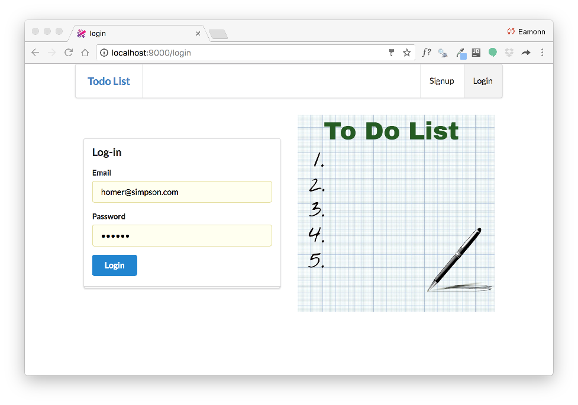

# Accounts Routes + Controler

Introduce the following new routes into the conf/routes file:

## conf/routes

~~~bash
GET    /signup                                  Accounts.signup
GET    /login                                   Accounts.login
~~~

These routes lead to an accounts controller, which we can now bring in:

## app/controllers/accounts.java

~~~java
package controllers;

import play.Logger;
import play.mvc.Controller;

public class Accounts extends Controller
{
  public static void signup()
  {
    render("signup.html");
  }

  public static void login()
  {
    render("login.html");
  }
}
~~~

Restart the app now, and you the signup/login forms should be rendered:

The submit buttons will not work yet however (try them).

Notice we seem to have missing images in the above. Download these two images here:

Place them in the `public/images` folder in your project. If this goes correctly, the views should look like this:

