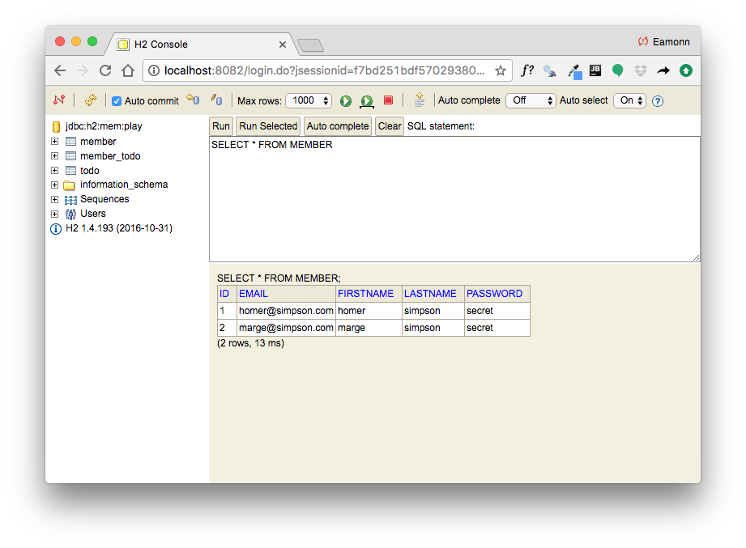
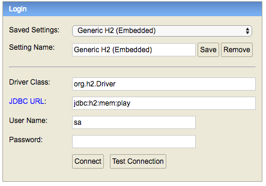
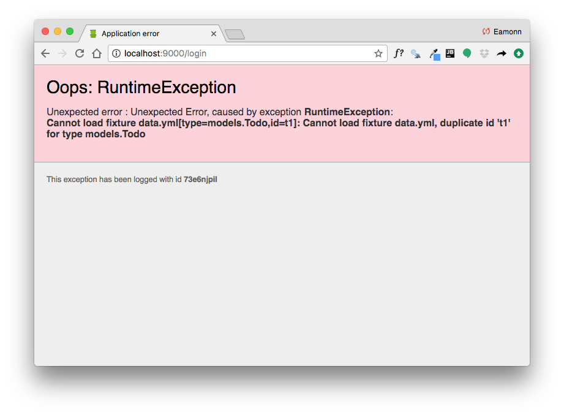

# Member model

We need a model to represent users (we will call them members) signed up to our application. Here is the class:

## app/models/Member.java

~~~java
package models;

import play.db.jpa.Model;

import javax.persistence.CascadeType;
import javax.persistence.Entity;
import javax.persistence.OneToMany;
import java.util.ArrayList;
import java.util.List;

@Entity
public class Member extends Model
{
  public String firstname;
  public String lastname;
  public String email;
  public String password;

  @OneToMany(cascade = CascadeType.ALL)
  public List<Todo> todolist = new ArrayList<Todo>();

  public Member(String firstname, String lastname, String email, String password)
  {
    this.firstname = firstname;
    this.lastname = lastname;
    this.email = email;
    this.password = password;
  }

  public static Member findByEmail(String email)
  {
    return find("email", email).first();
  }

  public boolean checkPassword(String password)
  {
    return this.password.equals(password);
  }
}
~~~

Look carefully at this class. It is relatively simple, except we see each menber has a `OneToMany` relationship to our existing todo class:

~~~java
  @OneToMany(cascade = CascadeType.ALL)
  public List<Todo> todolist = new ArrayList<Todo>();
~~~

We already have a `data.yml` file containing some todos:

## conf/data.yml

~~~yaml
Todo(t1):
  title: Make tea

Todo(t2):
  title: Go for snooze

Todo(t3):
  title: Make more tea
~~~

We can extend this now, with some member objects:

~~~yaml
Todo(t1):
  title: Make tea

Todo(t2):
  title: Go for snooze

Todo(t3):
  title: Make more tea

Member(m1):
  firstname: homer
  lastname: simpson
  email: homer@simpson.com
  password: secret

Member(m2):
  firstname: marge
  lastname: simpson
  email: marge@simpson.com
  password: secret
~~~

Restart the app now - and browse to the database:

- <localhost:9000/@db>

When you connect, you should be able to see the Members table containing the users above:

You should make sure you can view the above. If you cannot, it may be:

- incorrect connection string in the database login panel:

- you connect before the app at properly launched. Do not browse to database until you have seen the first screen in the browser
- you are connect to a previous version of the app. Just close the browser window and connect again.

Before proceeding, try to work out a procedure for reliably and consistently connecting to the database.

## Database Errors

One last small change. Occasionally you will see an error from the app related to the database, particularly when you are making some small adjustments to the app, but without restarting

Here is a small change to `Bootstrap.java` which will fix this problem:

## app/Bootstrap.java

~~~java
import java.util.List;

import play.*;
import play.jobs.*;
import play.test.*;

import models.*;

@OnApplicationStart
public class Bootstrap extends Job
{
  public void doJob()
  {
    if (Member.count() == 0)
    {
      Fixtures.loadModels("data.yml");
    }
  }
}
~~~

