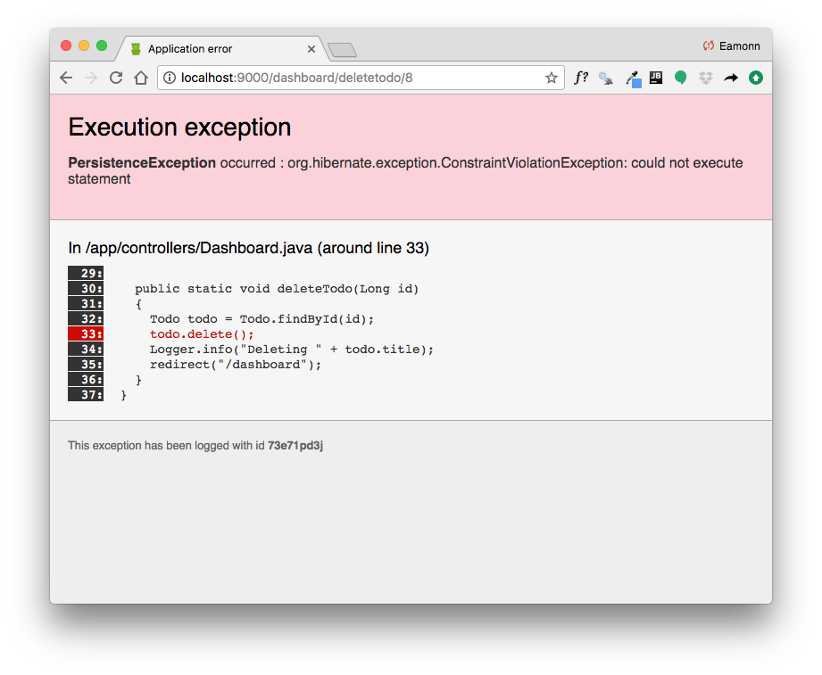

# Delete Todos

Delete a todo will cause an error:

We will need to rethink how we do the todo delete method.

The main problem is that any given todo now 'belongs' to a member - so just deleting it will cause a problem for the 'integrity' of the database.

Here is a revised version of the method:

## app/controllers/Dashboard.java

~~~java
...
  public static void deleteTodo(Long id, Long todoid)
  {
    Member member = Member.findById(id);
    Todo todo = Todo.findById(todoid);
    member.todolist.remove(todo);
    member.save();
    todo.delete();
    Logger.info("Deleting " + todo.title);
    redirect("/dashboard");
  }
...
~~~

This version is different:

- we are expecting the id of the member + the id of the todo
- We fetch both the member and the todo from the database
- remove it from the member list
- save the member
- delete the todo

For this to work, we need this revised route:

## conf/routes

~~~bash
GET     /dashboard/{id}/deletetodo/{todoid}     Dashboard.deleteTodo
~~~

(replace the existing deleteTodo route)

We also need a completely revised button in the dashboard:

~~~html
        <td> <a href="/dashboard/${member.id}/deletetodo/${todo.id} " class="ui tiny red button"> Delete </a> </td>
~~~

Restart the app - and verify that the todos can now be deleted successfully.