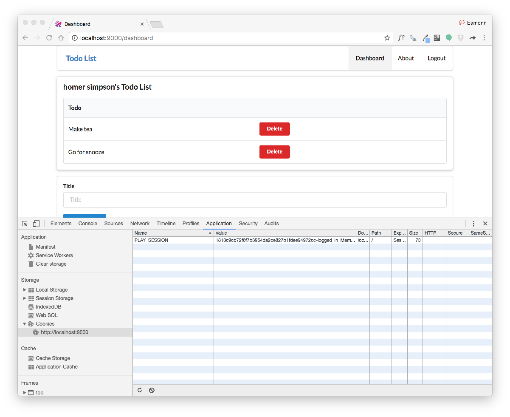
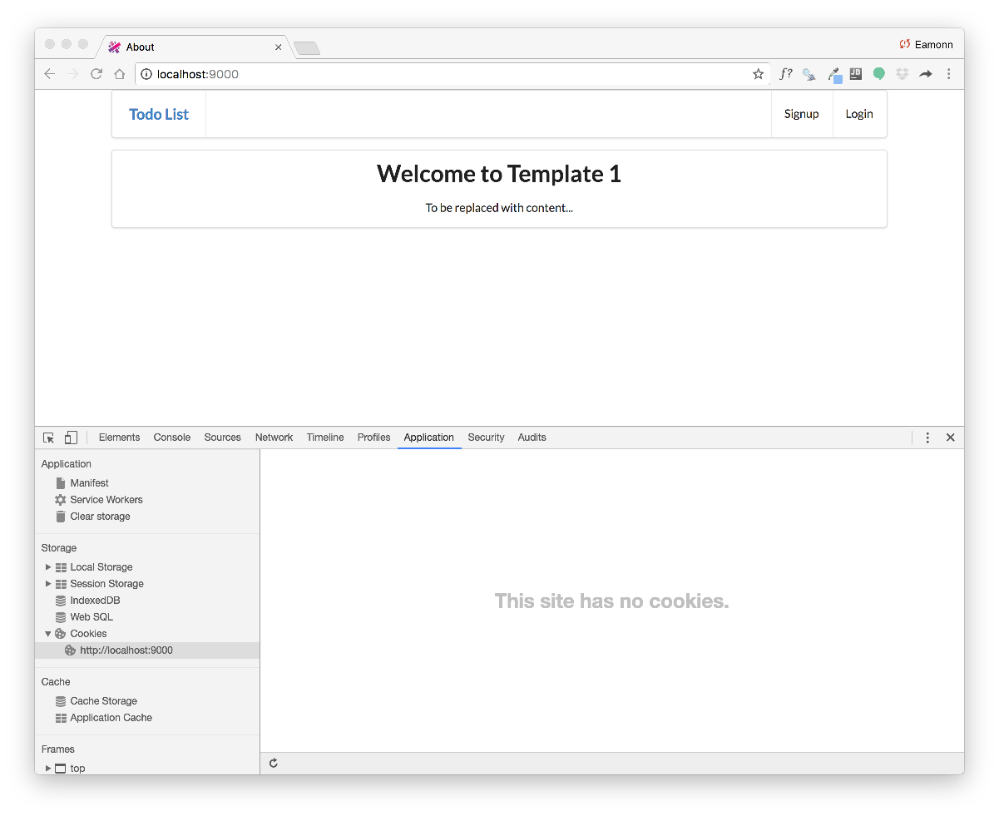
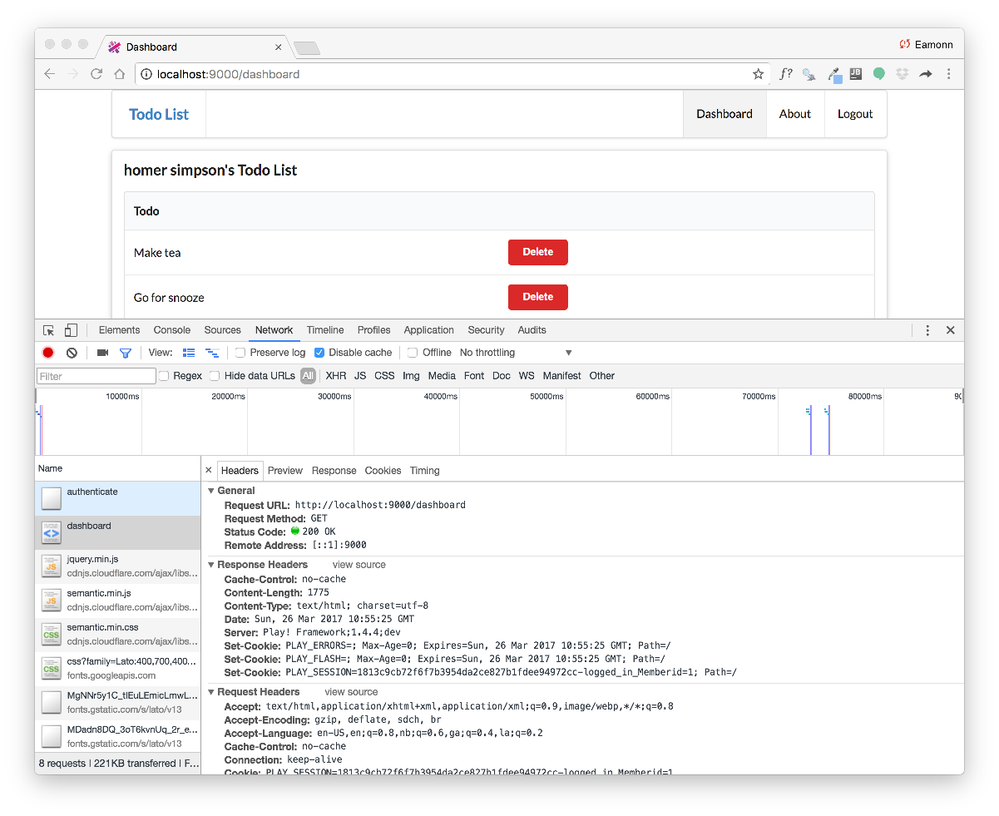

# Exercises

Archive of the project so far:

- <https://github.com/wit-hdip-comp-sci-2020/todolist/releases/tag/todolist-2.end>

## Exercise 1: Locate the Session Cookie in Chrome Developer Tools

The developer tools in chrome allow you to see in detail the workings of the browser. In particular, under `Application->Cookies` we can see the cookie our application has created:

If we log out, it will be deleted:

Experiment with locating the cookie - try to delete it manually, and see what effect it has on the app.

The developer tools can also reveal the cookie in transit during a request:

See if you can locate the above view in Chrome.

## Exercise 2: Introduce sessions into Playlist.

This is the final playlist project:

- <https://github.com/edeleastar/playlist/releases/tag/playlist.4.end>

Using this, or your own completed solution from lab 09, try to incorporate the `session` support we have just implemented in todo into the playlist app.

Essentially, we would like only members to be able to use the playlist app, and the members playlists are kept separate from other members.