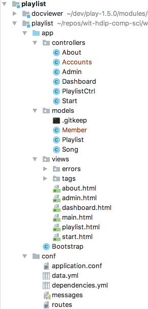

# Accounts + Members

This lab assumes you have completed Lab-09b: Playlist-4. If you are unsure - you can download this completed version:

- <https://github.com/wit-hdip-comp-sci-2020/playlist/releases/tag/playlist.4.end>

The Todolist application evolved `Member` model + an  `Accounts` controller that we used to manage signup/login features. These are the classes from the Todo appkication here:

## Accounts

~~~java
package controllers;

import models.Member;
import play.Logger;
import play.mvc.Controller;

public class Accounts extends Controller
{
  public static void signup()
  {
    render("signup.html");
  }

  public static void login()
  {
    render("login.html");
  }

  public static void register(String firstname, String lastname, String email, String password)
  {
    Logger.info("Registering new user " + email);
    Member member = new Member(firstname, lastname, email, password);
    member.save();
    redirect("/");
  }

  public static void authenticate(String email, String password)
  {
    Logger.info("Attempting to authenticate with " + email + ":" + password);

    Member member = Member.findByEmail(email);
    if ((member != null) && (member.checkPassword(password) == true)) {
      Logger.info("Authentication successful");
      session.put("logged_in_Memberid", member.id);
      redirect ("/dashboard");
    } else {
      Logger.info("Authentication failed");
      redirect("/login");
    }
  }

  public static void logout()
  {
    session.clear();
    redirect ("/");
  }

  public static Member getLoggedInMember()
  {
    Member member = null;
    if (session.contains("logged_in_Memberid")) {
      String memberId = session.get("logged_in_Memberid");
      member = Member.findById(Long.parseLong(memberId));
    } else {
      login();
    }
    return member;
  }
}
~~~

## Member

~~~java
package models;

import play.db.jpa.Model;

import javax.persistence.CascadeType;
import javax.persistence.Entity;
import javax.persistence.OneToMany;
import java.util.ArrayList;
import java.util.List;

@Entity
public class Member extends Model
{
  public String firstname;
  public String lastname;
  public String email;
  public String password;

  @OneToMany(cascade = CascadeType.ALL)
  public List<Todo> todolist = new ArrayList<Todo>();

  public Member(String firstname, String lastname, String email, String password)
  {
    this.firstname = firstname;
    this.lastname = lastname;
    this.email = email;
    this.password = password;
  }

  public static Member findByEmail(String email)
  {
    return find("email", email).first();
  }

  public boolean checkPassword(String password)
  {
    return this.password.equals(password);
  }
}
~~~

Bring these two classes into your Playlist application now. The Member class will have an error:

~~~
  public List<Todo> todolist = new ArrayList<Todo>();
~~~

This is a holdover from the Todo application. Replace the above line with this:

~~~
  public List<Playlist> playlists = new ArrayList<Playlist>();
~~~

Each member will have a list of `Playlist` objects, called playlists. This is the members personal collection of playlists.

The project should now be without errors:

