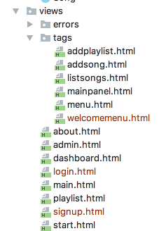

# Signup & Login Forms + welcome Memu

Todolist also has signup and login views - which implement simple forms for this purpose:

## views/signup.html

~~~html
#{extends 'main.html' /}
#{set title:'Signup' /}
#{welcomemenu id:"signup"/}

    

        <form class="ui stacked segment form" action="/register" method="POST">
            <h3 class="ui header">Register</h3>
            

                

                    <label>First Name</label>
                    <input placeholder="First Name" type="text" name="firstname">
                

                

                    <label>Last Name</label>
                    <input placeholder="Last Name" type="text" name="lastname">
                

            

            

                <label>Email</label>
                <input placeholder="Email" type="text" name="email">
            

            

                <label>Password</label>
                <input type="password" name="password">
            

            <button class="ui blue submit button">Submit</button>
        </form>
    

    

        
    

~~~

## views/login.html

~~~html
#{extends 'main.html' /}
#{set title:'login' /}
#{welcomemenu id:"login"/}

  

    <form class="ui stacked segment form" action="/authenticate" method="POST">
      <h3 class="ui header">Log-in</h3>
      

        <label>Email</label> <input placeholder="Email" name="email">
      

      

        <label>Password</label> <input type="password" name="password">
      

      <button class="ui blue submit button">Login</button>
    </form>
  

  

    
  

~~~

It also has this partial - a menu to support signup + login options:

## views/tags/welcomemenu.html

~~~html
<nav class="ui menu">
  <header class="ui header item"> <a href="#"> Playlist 5 </a></header>
  

    <a id="signup" class="item" href="/signup"> Signup  </a>
    <a id="login" class="item" href="/login">  Login   </a>
  

</nav>

~~~

Bring this in now.

The existing `menu.html` will need an additional option to support log out:

## views/tags/menu.html

~~~html
<nav class="ui menu">
  <header class="ui header item"> <a href="#"> Playlist 5 </a></header>
  

    <a id="dashboard" class="item" href="/dashboard"> Dashboard  </a>
    <a id="about" class="item" href="/about"> About </a>
    <a id="logout" class="item" href="/logout"> Logout </a>
  

</nav>

~~~

We should change the `start` view to include this menu instead of the main menu:

## views/start.html

~~~java
#{extends 'main.html' /}
#{set title:'Start' /}

#{welcomemenu id:"start"/}

<section class="ui center aligned middle aligned segment">
  <h1 class="ui header">
    Welcome to Playlist 5
  </h1> 
  

    A small app to let you compose playlists. This app will allow you to create, manage and share your playlists. Simple enter the playlist details one the dashboard.

    Please Signup or Login using the menu above.
  

</section>
~~~

The view folder of the project should now look like this:

