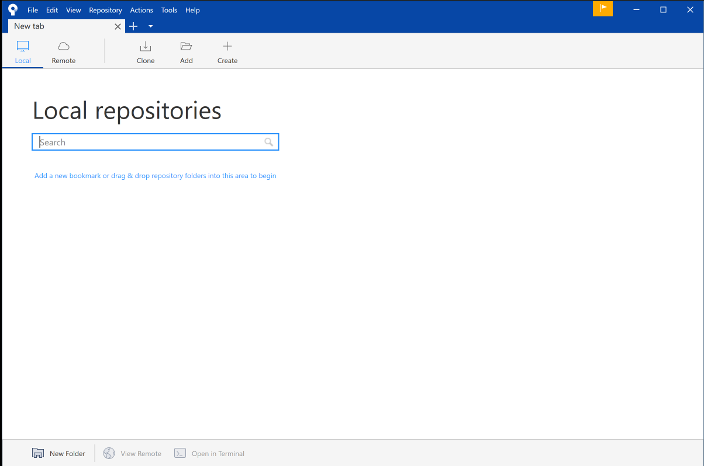

# Install Sourcetree

Visit:

- <https://www.sourcetreeapp.com/>

And download and install the application for your platform.

On the very first screen - you will be asked to log in to you Atlassian Bitbucket account. You should have created this in the last step. 

Select 'Bitbucket' (NOT Bitbucket Server) in the first screen:

This will direct you to log in / sign up to the Bitbucket service. Once your account is verified, you should see this:

In the next screen, select advanced options and select the options below:

Enter your full name and email address:

You will be asked about ssh keys - you can skip this step for the moment:

You will eventually get this start screen:

The installation will be automatically linked to a bitbucket account. 

In the next step we will connect Sourcetree to your GitHub account.

