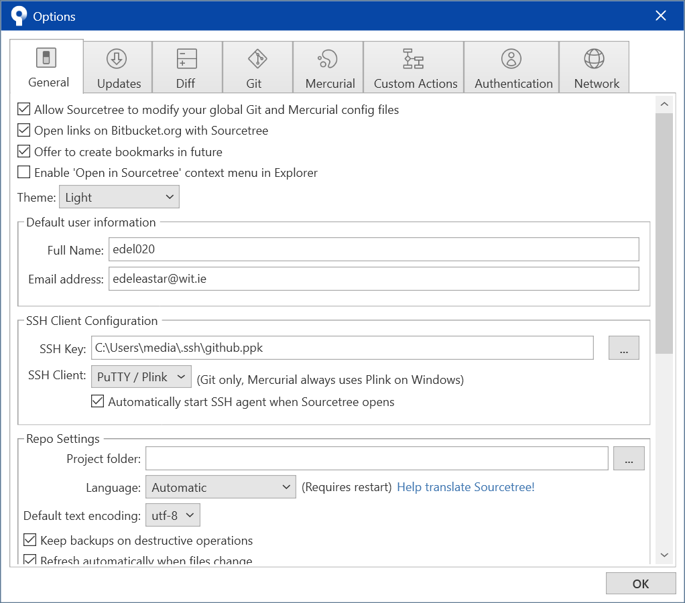
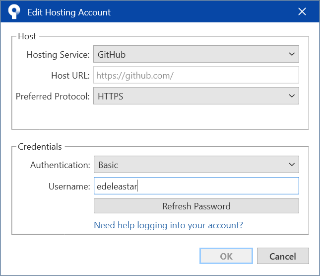
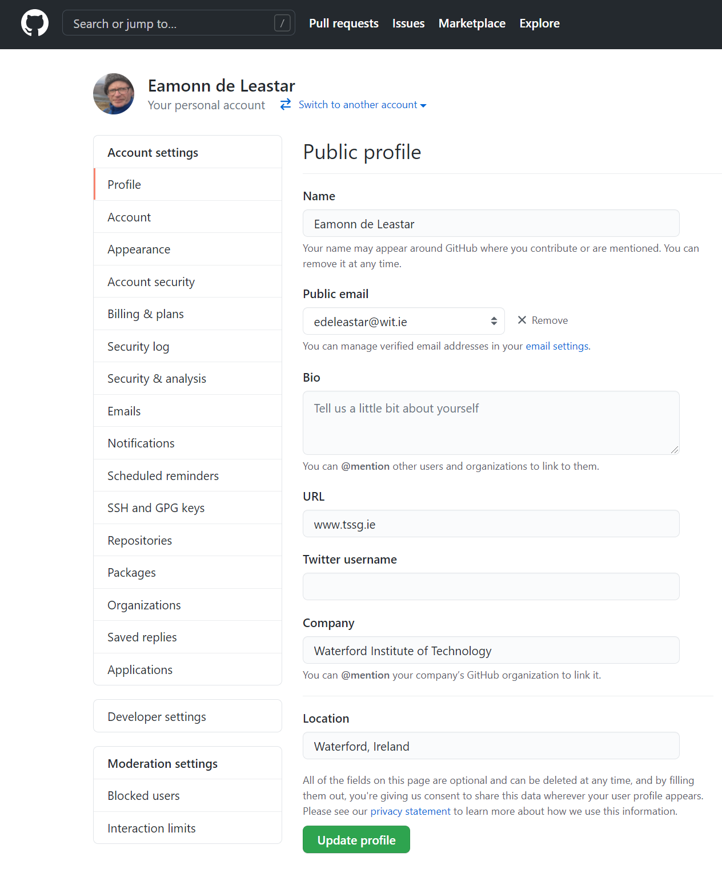
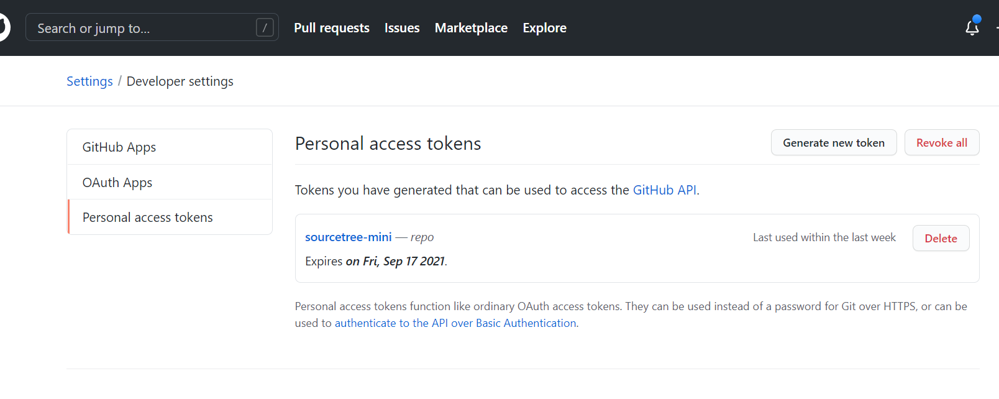
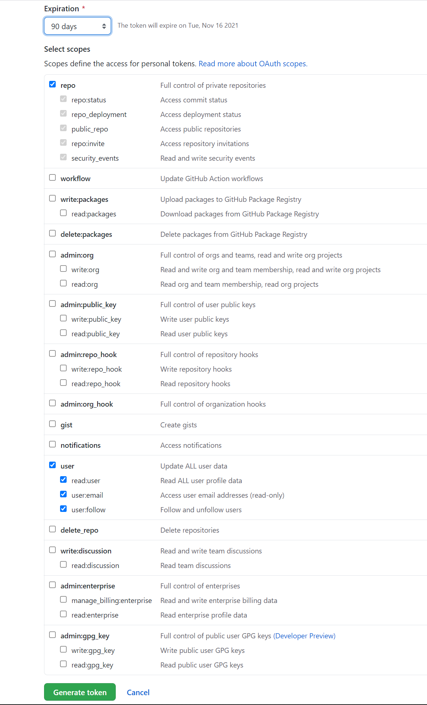
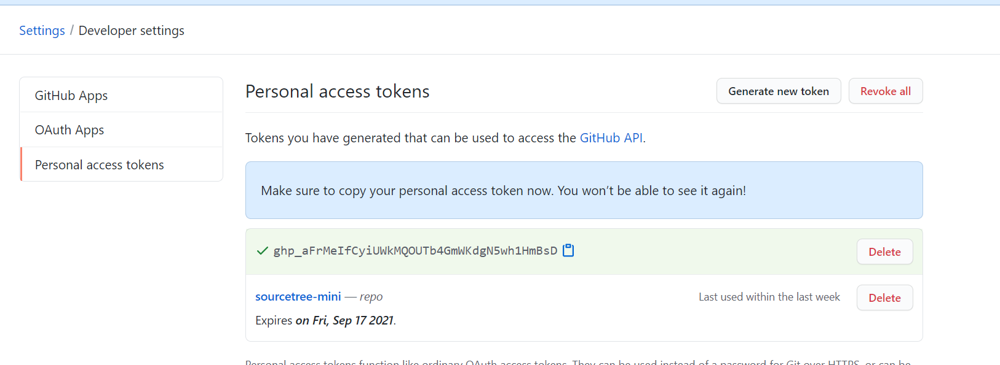
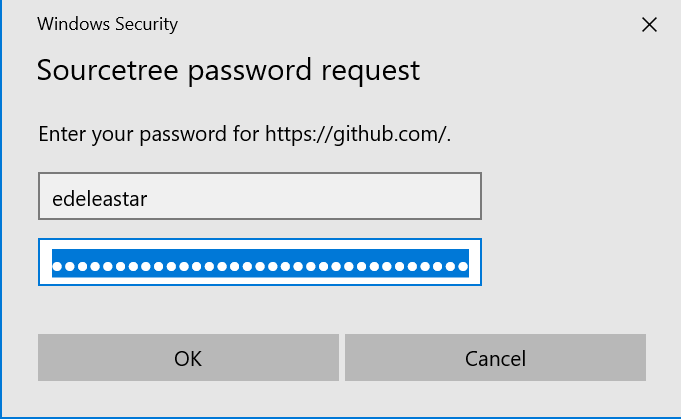
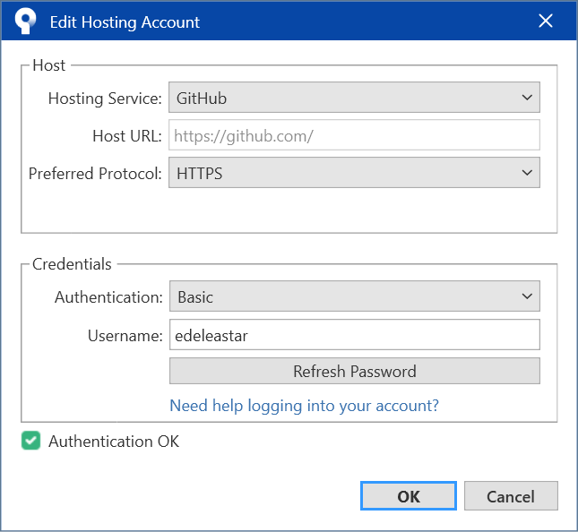

# Github Account Linkup

There are a number of ways of Authenticating to Github and Sourcetree can be configured to use these. The preferred technique is [to use SSH](https://docs.github.com/en/github/authenticating-to-github/connecting-to-github-with-ssh), which is probably the optimal approach in the longer term. However, Github has a simpler mechanism called [Personal Access Tokens](https://docs.github.com/en/github/authenticating-to-github/keeping-your-account-and-data-secure/creating-a-personal-access-token), which we will walk through below.

In Sourcetree Settings:

Select `Authentication` and add a Github account (if you already have Github account set up, it might be simplest to remove it first now). When adding a new account, make sure to select the options are as below:

In particular:

- use your Github username
- select `HTTPS` for preferred protocol
- select `Basic` for Authentication. 

The next step will be to select `Refresh Password` - however the password required here is not your standard Github account password, but a special token we will now generate.

To do this, log in to your Github account in a browser, and locate your profile settings:

Select `Developer Settings` on the left, and then and then select `Personal access tokens`

Press `Generate new token`, and then select the options as shown below:

The token can be set to unlimited (which is not recommended). Perhaps select 90 days.

Give the token a name and press the `Generate token` button. You will then see the generated token and be able to copy it to the clipboard:

The token will disappear if you switch away form this page - so be sure to copy it now. If you loose the token, you can always delete the one you created and regenerate again.

Finally, back on Sourcetree:

... you are in a position to press `Refresh Password`:

Here you will be pasting in the token generated on the Github site (in your clipboard hopefully). Press `Ok`

... and if all goes well the you should get an `Authentication OK` response as shown above.

You will not be able to clone github repos (over HTTPS), and be able to push to these repos from Sourcetree.

