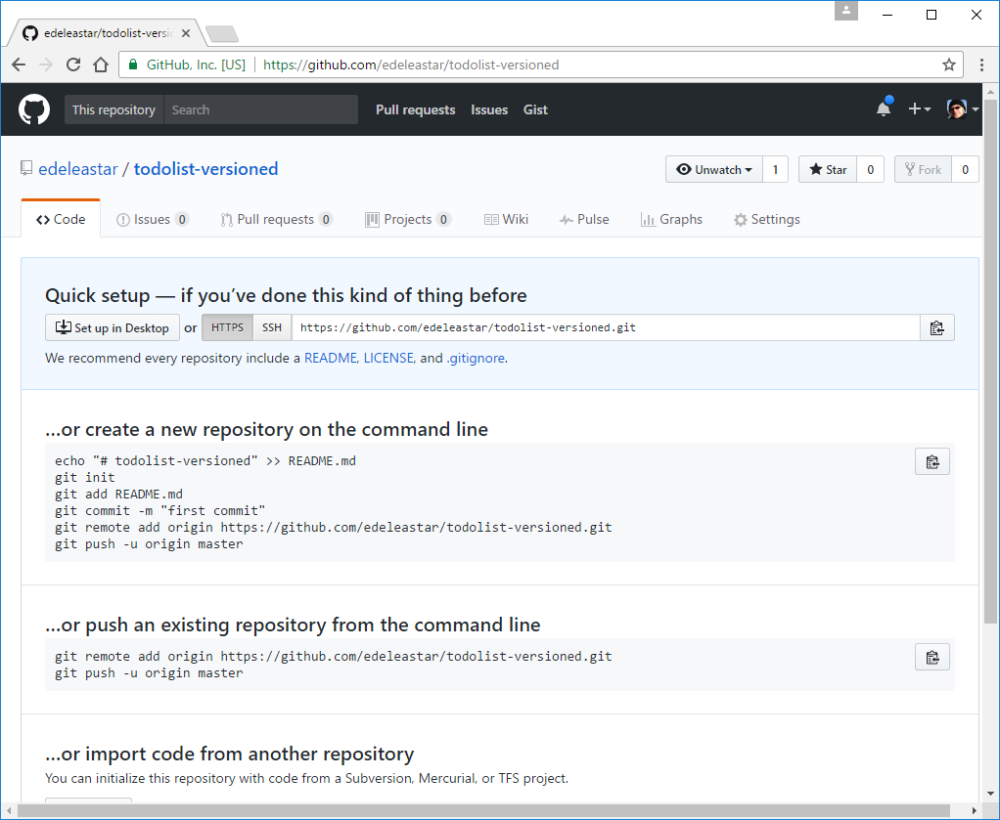

# Create new Repo on Github

Back on github:

- <https://github.com>

Create a new repository:

This will create a new empty repo on github.

Note carefully the url of the repo - in the box above. Copy this to the clipboard now.
