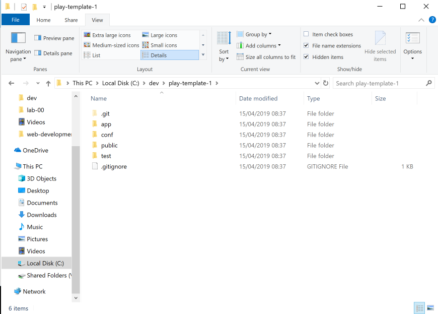

# Create New Application

We now would like to start a new play application, which we will associate with the github repository we have just crested.

First, create a new app by cloning a starter app:

## Create New Project

Create a new play project using this command:

~~~bash
git clone https://github.com/wit-hdip-comp-sci-2020/play-template-1
~~~

The shell should show something like this:

~~~bash
Cloning into 'play-template-1'...
remote: Counting objects: 66, done.
remote: Compressing objects: 100% (47/47), done.
remote: Total 66 (delta 9), reused 66 (delta 9), pack-reused 0
Unpacking objects: 100% (66/66), done.
~~~

## Rename Project

The default name of the project should be changed now. This will require the following procedure:

- Rename the folder `play-template-1`. Call the folder `todolist-versioned` instead.
- Use Sublime Text to edit this file: `playlist/conf/application.conf`. The first three lines contains the following:

    ~~~bash
    # This is the main configuration file for the application.
    # ~~
    application.name=play-template-1
    ~~~

- Change `play-template-1` above to `todolist-versioned`, and save the file:

    ~~~bash
    # This is the main configuration file for the application.
    # ~~
    application.name=todolist-versioned
    ~~~

## Unbind from github

This app has been cloned from github - and is still bound to the repository it was cloned from. We can break this link - and we will reestablish a link to a new github repository you will create in the next steps. 

To break the existing link, simply completely delete the `.git` folder form the project:

(you may need to reveal `hidden files` to see the folder)

