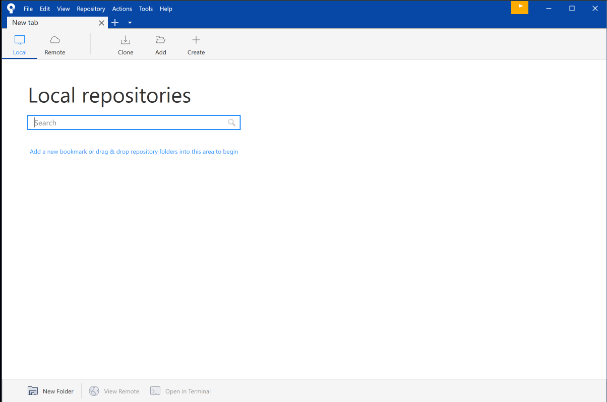
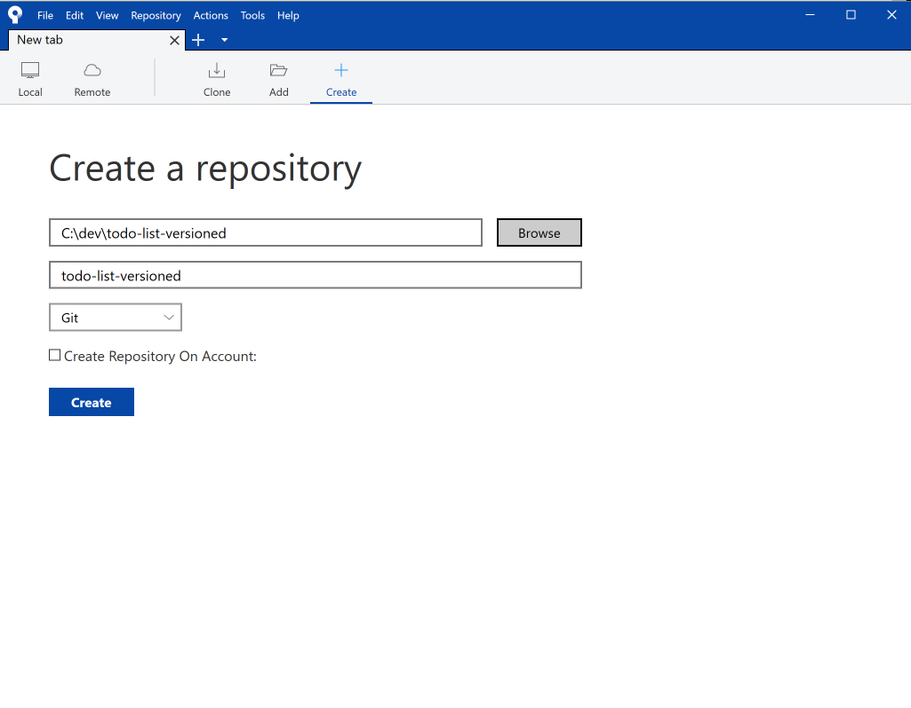
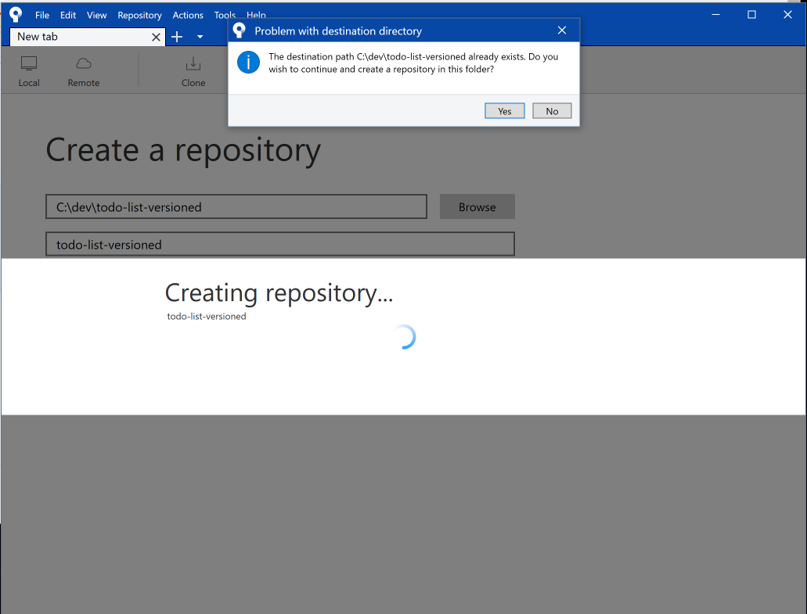
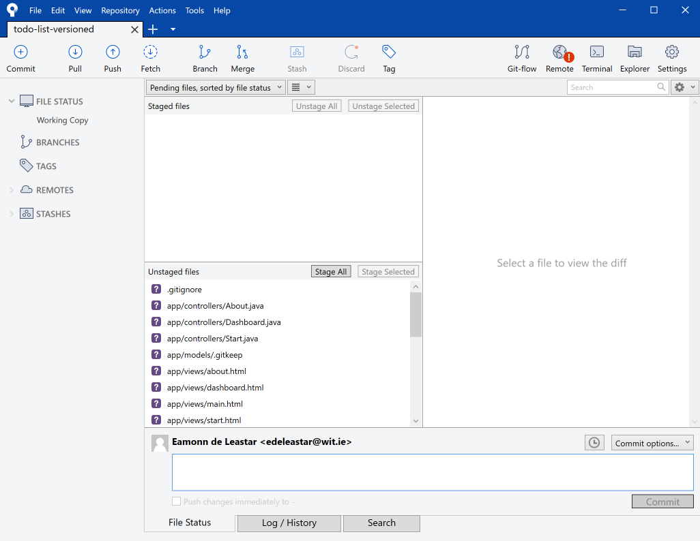
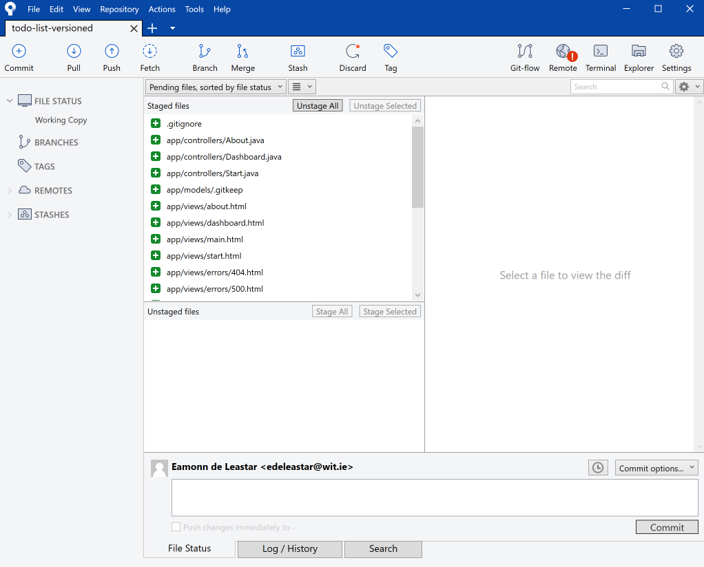
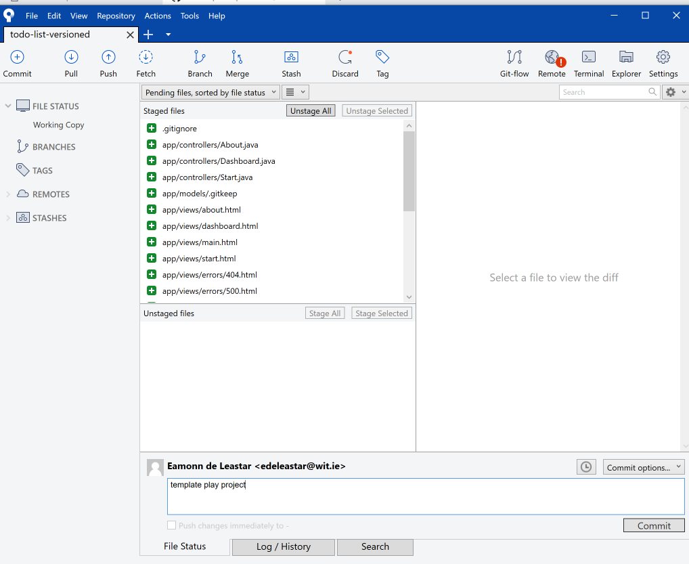
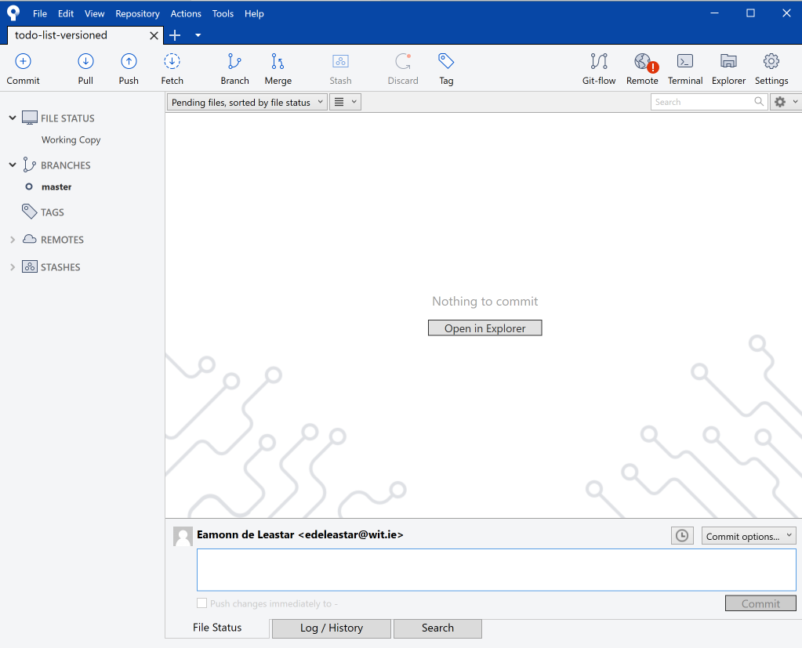
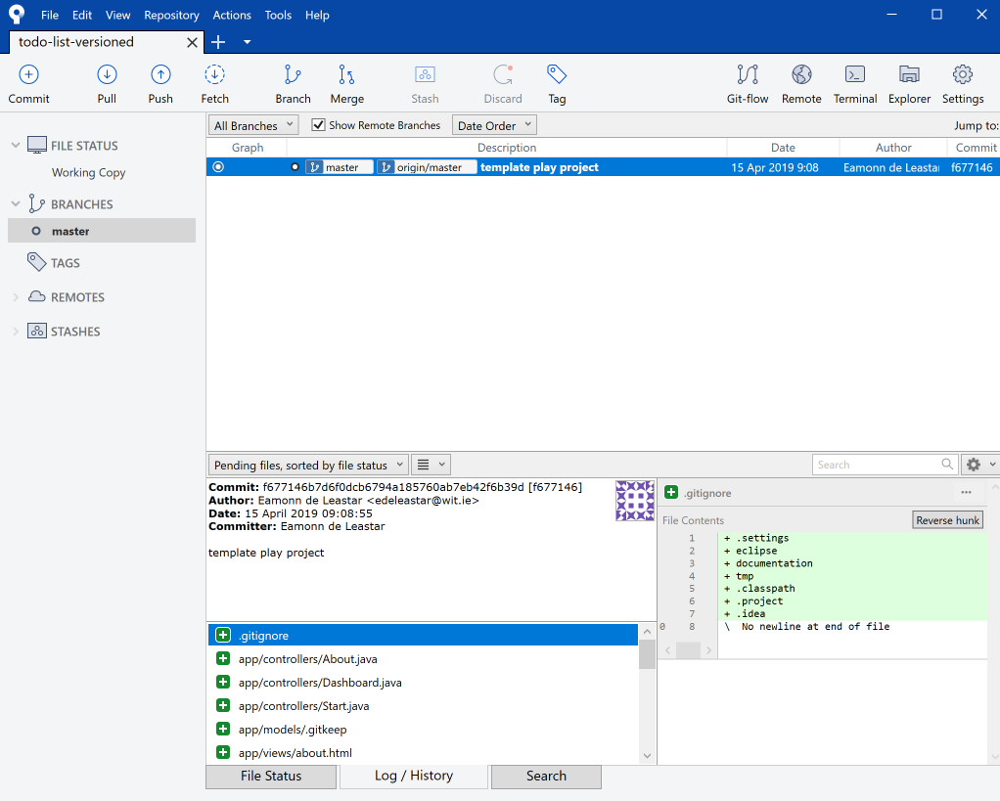

# Set Remote Repo

Your Sourcetree app currently looks like this (press the 'Local' button)

Select the Create button from the toolbar and locate the folder containing the project we have just created:

Press Create - and select Yes in the subsequent dialog:

Sourcetree will now be configured as shown:

We can now 'stage' all of the sources in the project by pressing the 'Stage All' button:

With the configuration as shown above, enter a short message 'template play project' as shown:

Press 'Commit' and the Source tree will be configured like this:

Finally, select 'master' on the left:

This seems a complex, but the process is always the same:

- Stage: this is selecting which files to be added (or which changed files are to be added)
- Commit Message: a easily readable short message
- Commit : bind the changes + commit message and update the repository

