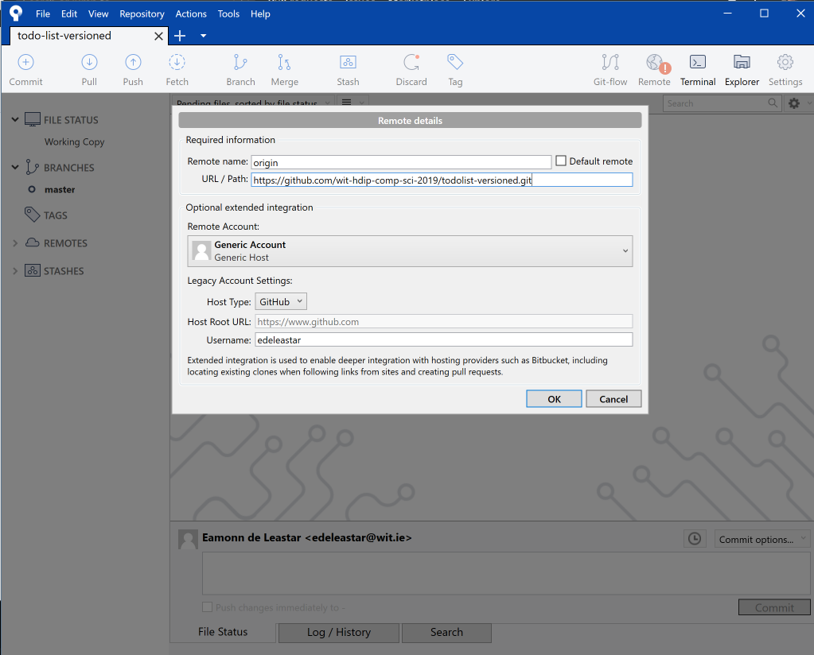
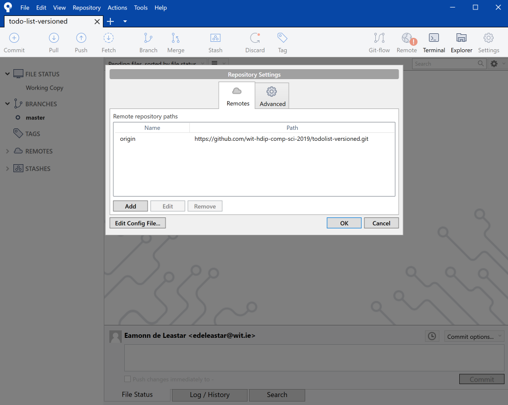
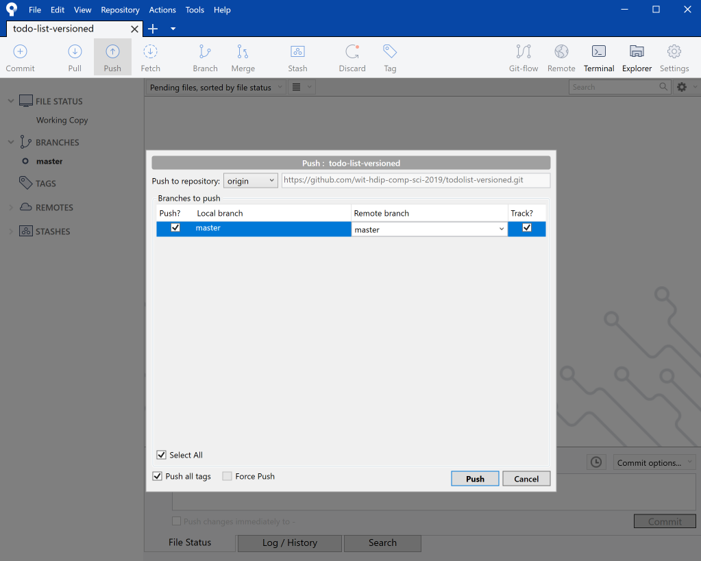
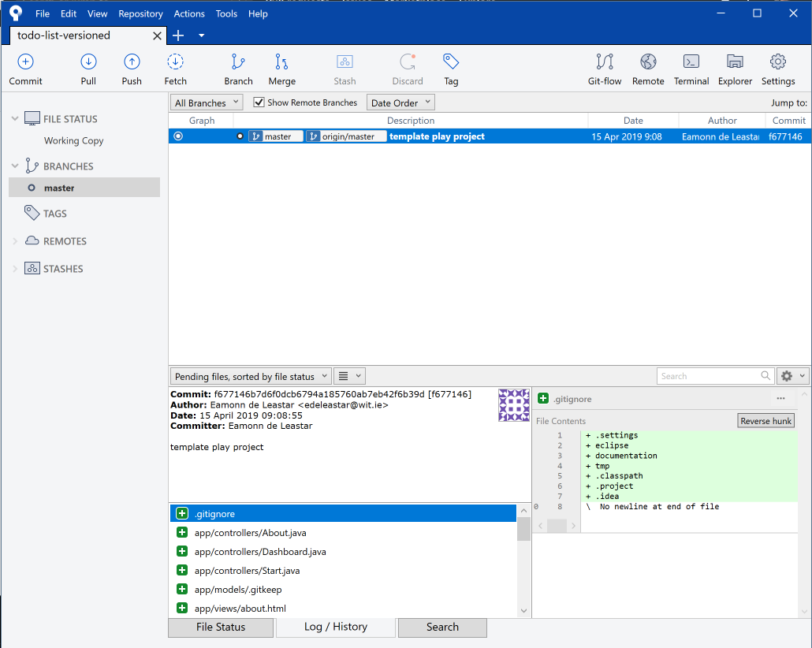
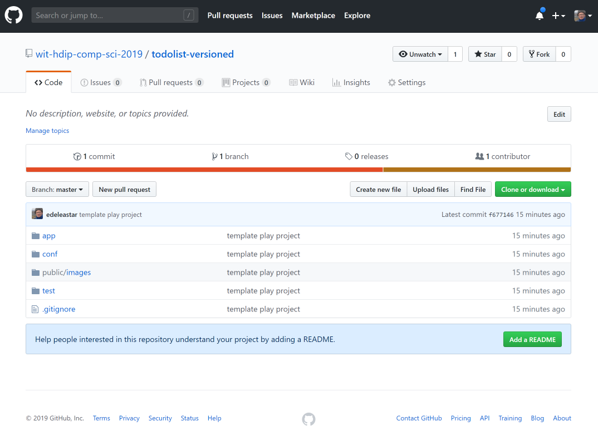

# Bind the Local Repo to a Remote one

Is Sourcetree, select Repository-Repository Settings:

Press add, and enter the following:

- Remote Name: 'origin'
- URL/Path : - enter the repository path that for the repository you created in Step 03 of this lab.

Press ok:

Back in the main Sourcetree window, press 'Push'

In the subsequent dialog, tick the checkbox next to 'master', and then press push. This will transfer a copy of the local files in the repository to the copy on github.

Eventually, Sourcetree will settle into this view:

.. and if you look at the github site and the repo you created in step 03, you should see a copy of the project:

The 'local' and 'remote' repositories are now linked - and changes we make locally we will need to explicitly push a 'commit' of new additions as we make them.

