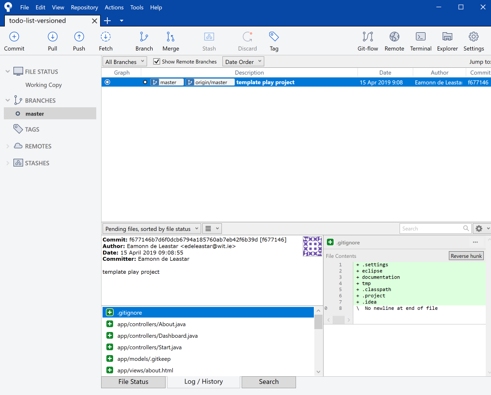
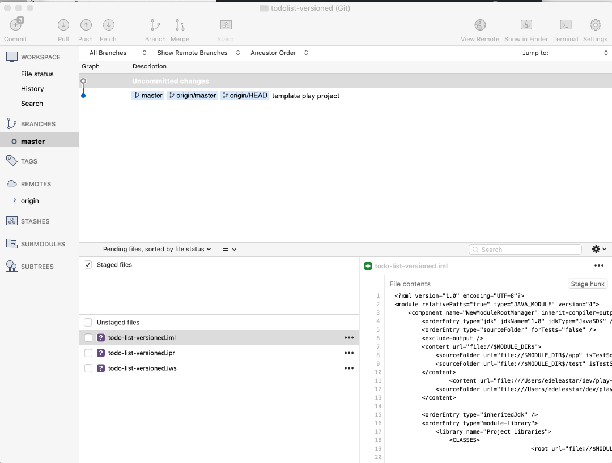
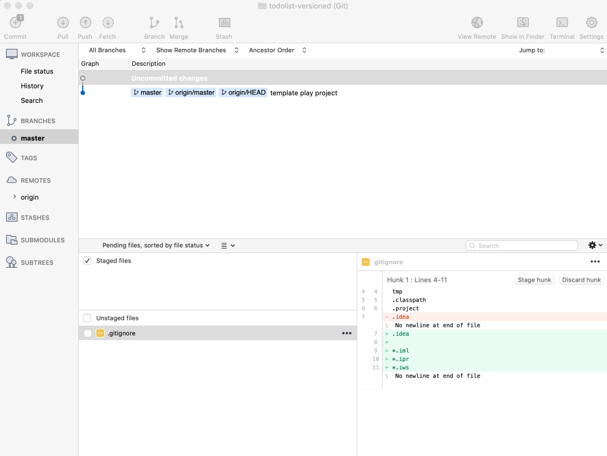
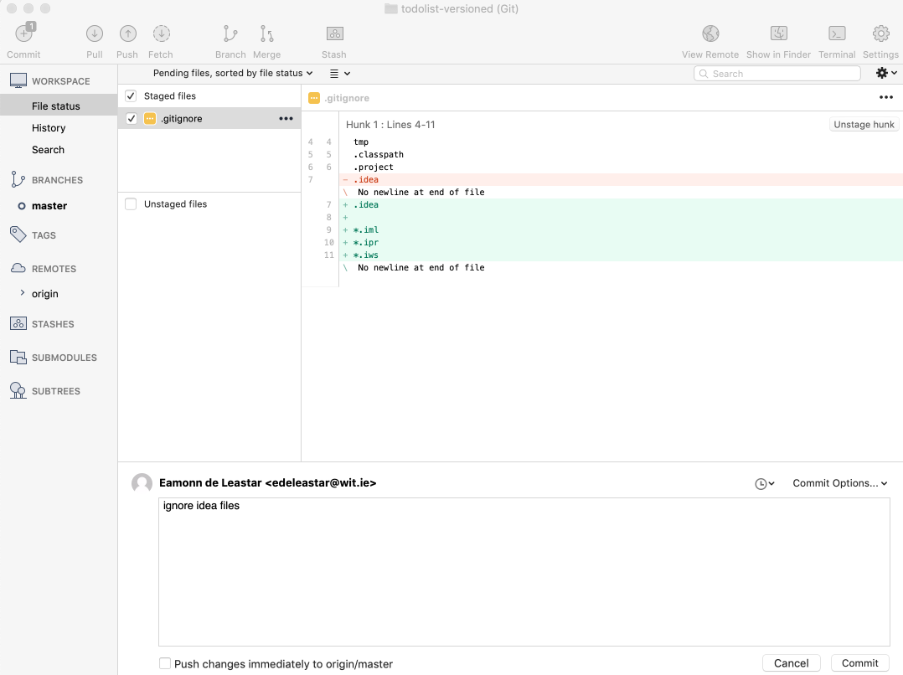
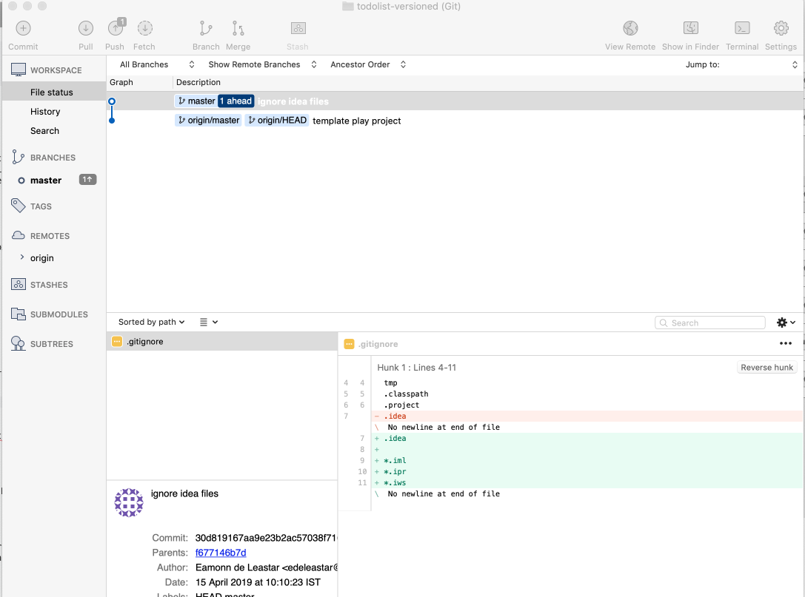
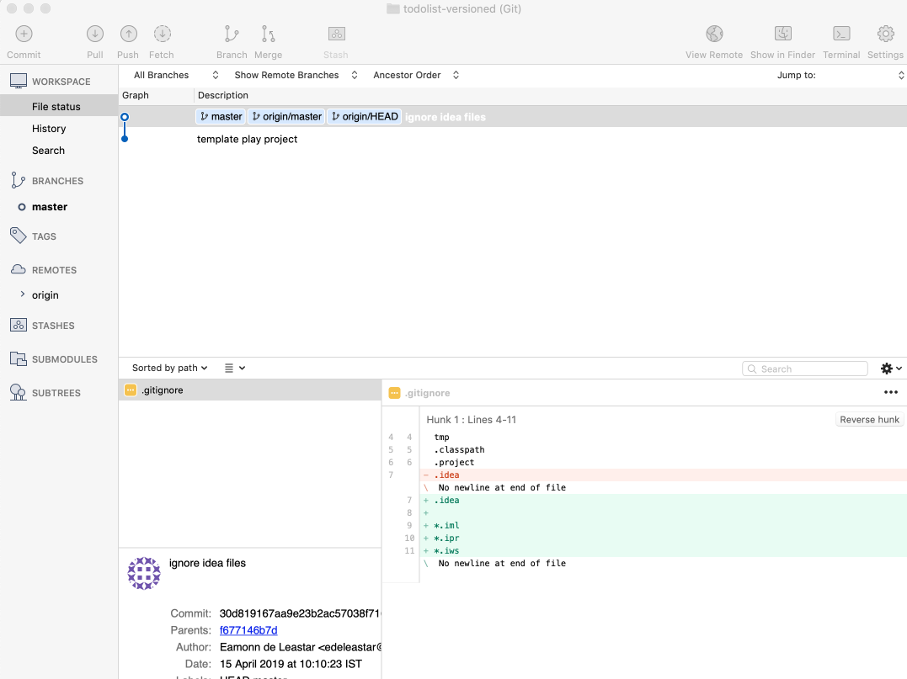

# todolist-versioned Project

We should have our project in Sourcetree from the last lab:

We would like to use Intellj Idea - we can 'idealize' then app:

~~~
play idealize
~~~

... and then import into Idea.

For this lab, keep both Idea & Sourcetree open at the same time.

The first thing to notice is the Sourcetree view will have changed slightly: 

This is because the idealize command as generated some new files in our project:

- todo-list-versioned.iml
- todo-list-versioned.ipr
- todo-list-versioned.iws

These are configuration file for Idea. We dont need to be concerned with them, and we dont want them committed to our repository as they are not code really. We need to tell git to ignore them.

The built in mechanism for ignoring files in git is to plate the file names, or patterns, in a file called `.gitignore`. We already have one:

## .gitgnore

~~~bash
.settings
eclipse
documentation
tmp
.classpath
.project
~~~

Edit it now in Idea - and append paths to ignore the Idea files:

~~~bash
...
*.iml
*.ipr
*.iws
~~~

Save this file - and review the Sourcetree view again:

The change is subtle - git is no longer 'tracking' the idea files, but notice that it reporting the one of the files we are tracking - .gitignore - is showing up as having a change.

This change is noted, but not 'staged' or 'committed' yet. We will do both now

To stage the changes, we just select all the 'Unstaged files' check box - which reconfigures the view like this:

Enter the commit message 'ignore idea files' as shown and press commit

Once committed, a small badge will appear over the 'Push' button in the toolbar. This is because changes we have just made locally are not yet replicated on the github (remote) version:

Press push now - and the repositories will be 'synced'

For each step in this lab we will be proceeding through this workflow:

- Make some changes to the project
- Stage the changes
- Commit the changes
- Push them to the remote repository
- Check to see if they have arrived (sometimes).

