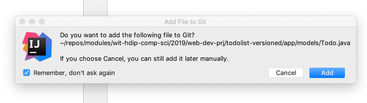
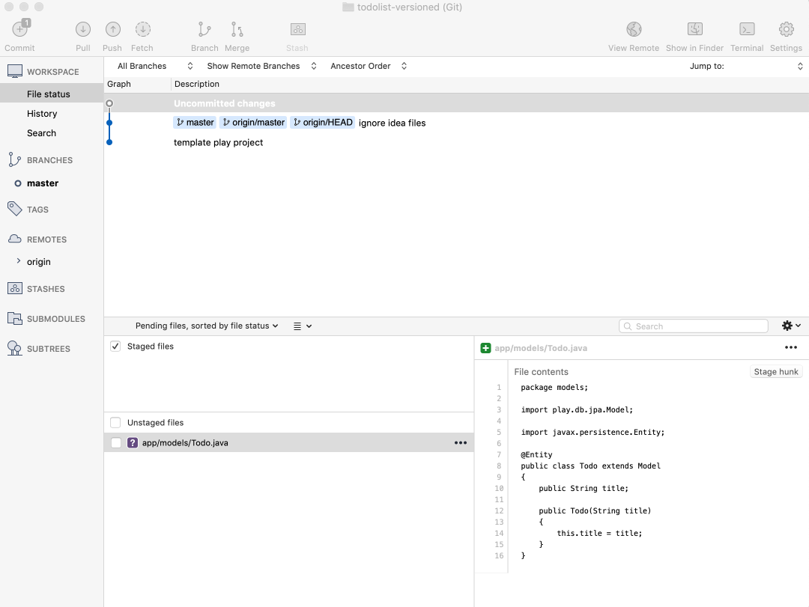
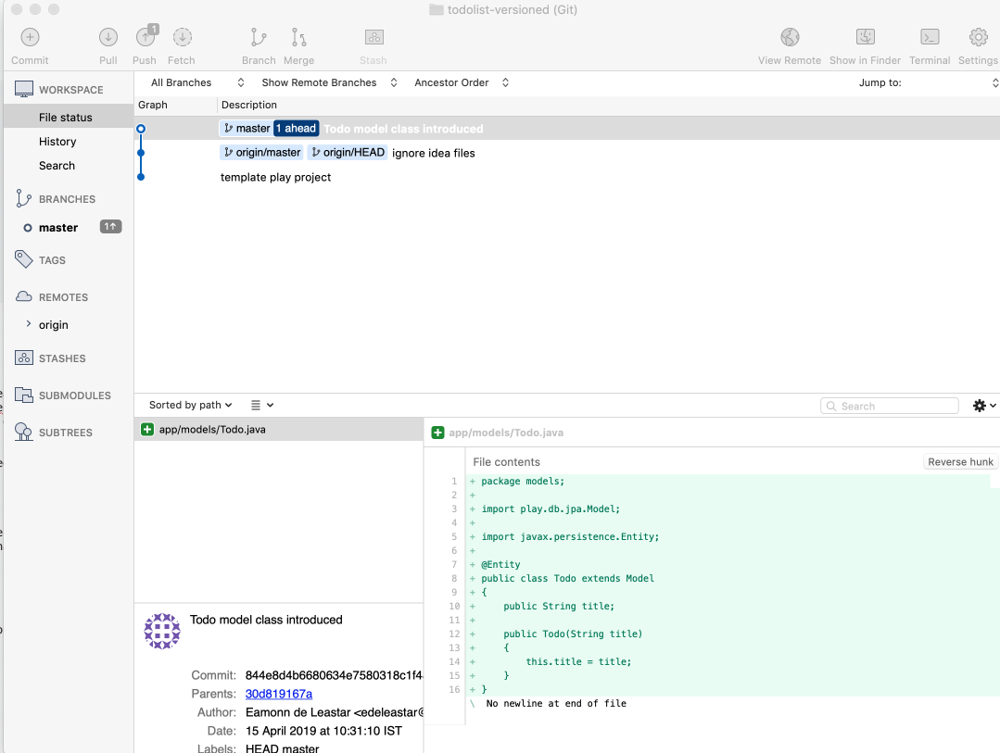
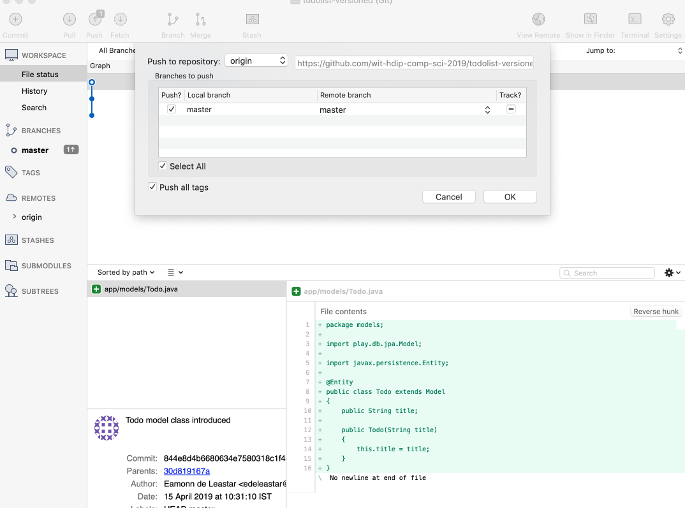
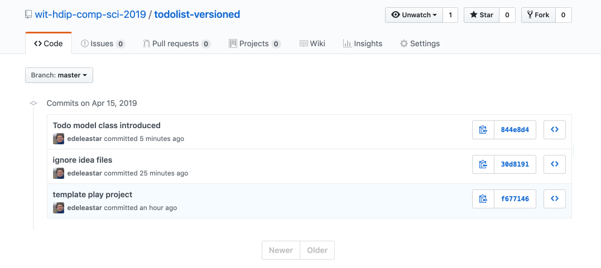

# Model

We can bring in a Todo model now:

## app/models/Todo.java

~~~java
package models;

import play.db.jpa.Model;

import javax.persistence.Entity;

@Entity
public class Todo extends Model
{
  public String title;

  public Todo(String title)
  {
    this.title = title;
  }
}
~~~

When you add a new class in Idea, you may get this prompt:

This is triggered because the project is a git repo now - and Idea can look after the stage/commit/push process we have just been through in Sourcetree. For this lab we will prefer to gain more experience using Sourcetree, so we will disable this feature and press 'cancel'.

As soon as we saved the class in Idea, notice the changes have been detected in Sourcetree:

We can stage, commit and push whenever we like - usually we stage and commit when we have introduced a significant change. We would only push occasionally.

Lets stage and commit now with the message 'Todo model class introduced'

We might also push :

On the github version of the repo, locate the 'commits' page, and verify that it is in sync with your local version:

