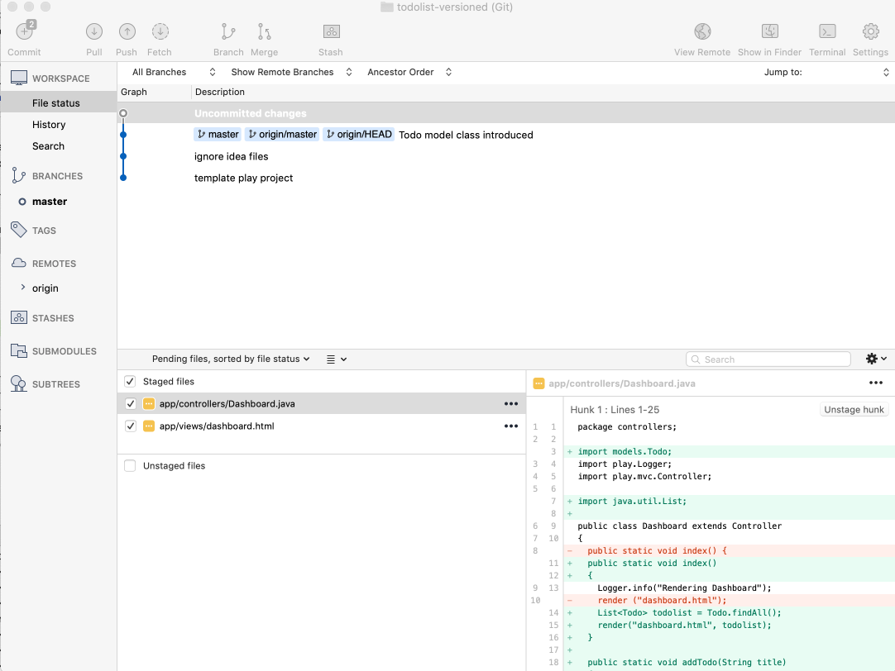
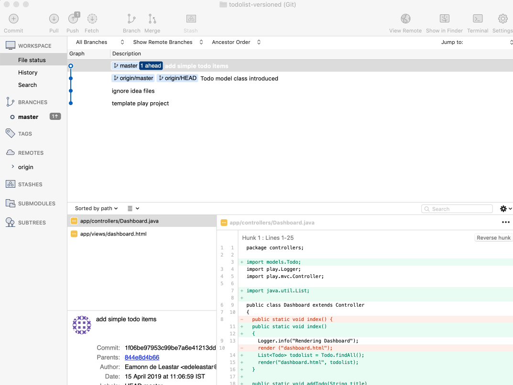
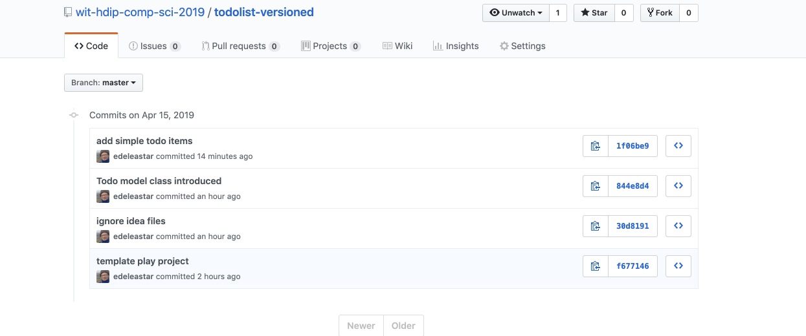

# Dashboard Controller + View

Here is a new version of the Dashboard controller + view:

## app/controllers/Dashboard.java

~~~java
package controllers;

import models.Todo;
import play.Logger;
import play.mvc.Controller;

import java.util.List;

public class Dashboard extends Controller
{
  public static void index()
  {
    Logger.info("Rendering Dashboard");
    List<Todo> todolist = Todo.findAll();
    render("dashboard.html", todolist);
  }

  public static void addTodo(String title)
  {
    Todo todo = new Todo(title);
    todo.save();
    Logger.info("Addint Todo" + title);
    redirect("/dashboard");
  }
}
~~~

## app/views/dashboard.html

~~~java
#{extends 'main.html' /}
#{set title:'Dashboard' /}

#{menu id:"dashboard"/}

<section class="ui raised segment">
  <header class="ui header">
    Todo List
  </header>
  <table class="ui fixed table">
    <thead>
    <tr>
      <th>Todo</th>
      <th></th>
    </tr>
    </thead>
    <tbody>
    

    #{list items:todolist, as:'todo'}
    <tr>
      <td> ${todo.title} </td>
    #{/list}
    

    </tbody>
  </table>

</section>

<form class="ui stacked segment form" action="/dashboard/addtodo" method="POST">
  

    <label>Title</label>
    <input placeholder="Title" type="text" name="title">
  

  <button class="ui blue submit button">Add Todo</button>
</form>
~~~

Run the app now - and verify that you can add todos.

Stage & Commit these changes - note the message used below:

