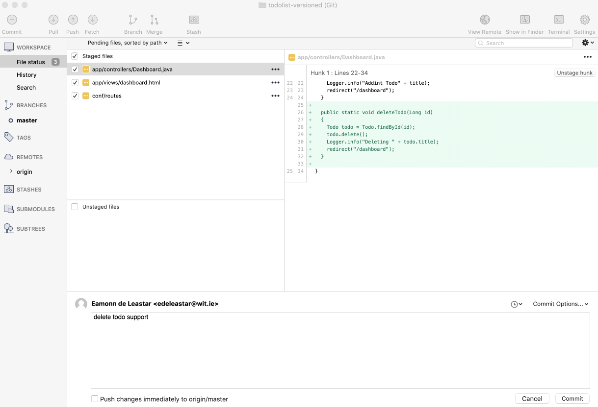
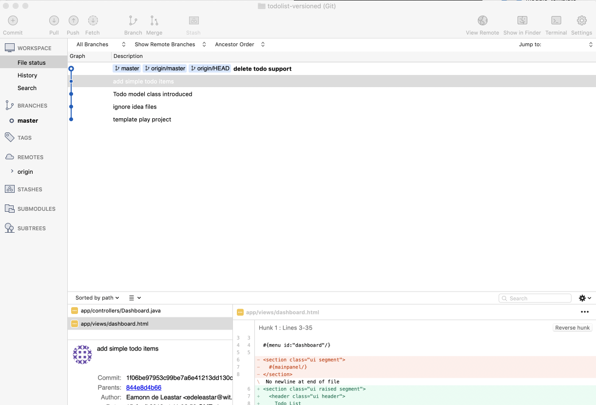

# Delete Todo Support

Now we can introduce delete support

## conf/routes

~~~bash
GET     /dashboard/deletetodo/{id}              Dashboard.deleteTodo
~~~

## app/controlers/Dashboard.java

~~~java
  public static void deleteTodo(Long id)
  {
    Todo todo = Todo.findById(id);
    todo.delete();
    Logger.info("Deleting " + todo.title);
    redirect("/dashboard");
  }
~~~

## app/views/dashboard.html

Revised list to include delete button:

~~~html
...
      #{list items:todolist, as:'todo'}
      <tr>
        <td> ${todo.title} </td>
        <td> <a href="/dashboard/deletetodo/${todo.id} " class="ui tiny red button"> Delete </a> </td>
      #{/list}
..
~~~

Stage and commit the above - use the commit message:

~~~bash
introduced delete todo support
~~~

