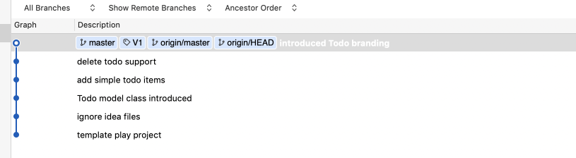
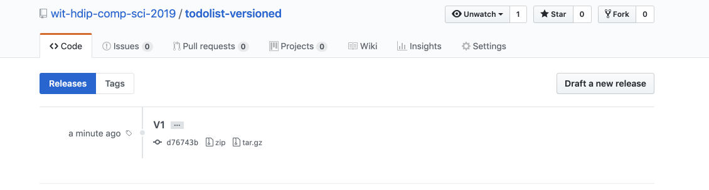

# UX Modifications

The app is still branded as 'Template 1' - we can change this now:

## app/views/tags/menu.html

~~~html
...
  <header class="ui header item"> <a href="/"> Todolist V1 </a></header>
...
~~~

## app/views/about.html

~~~html
...
  

    A simple Todo List Application
  

...  
~~~

## app/views/start.html

~~~html
...
  <h1 class="ui header">
    Welcome to Todolist V1
  </h1>
  

    Track your todos today!
  

...
~~~

Stage and commit all of the above.

We also might like to `Tag` this version as being significant - perhaps call it 'V1'. This will enable is to get back the this version later more easily.

To do this, first make sure you have 'pushed' all updates to github. Then select the most recent change and right clock to select the context menu:

Select 'Tag' and in the subsequent dialog:

.. Enter 'V1'. Also, check the 'Push Tag' check box in the dialog as shown above. Then press add.

A 'V1 tag' should now be visible in the commit history:

If you visit the repo on github - then this version will be marked as a `Release` called V1:

